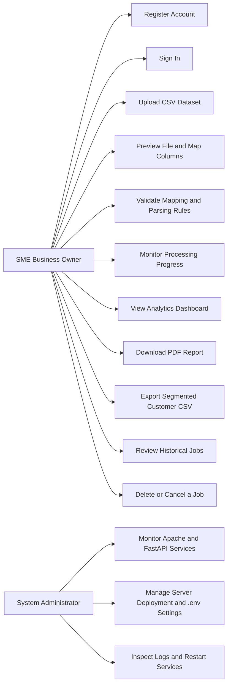
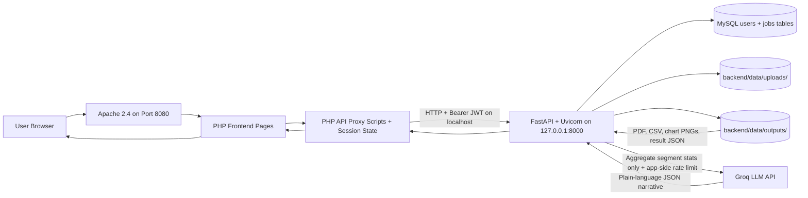
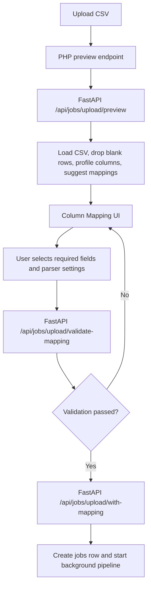
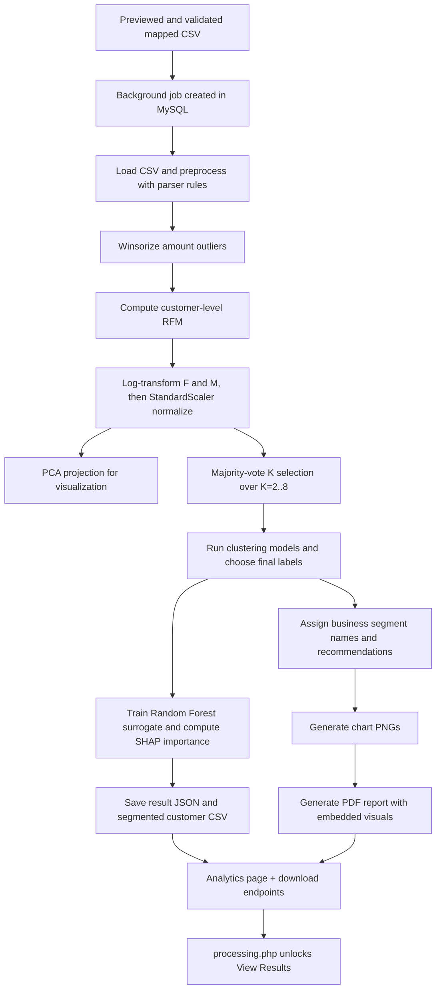
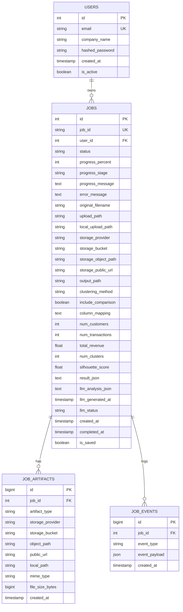
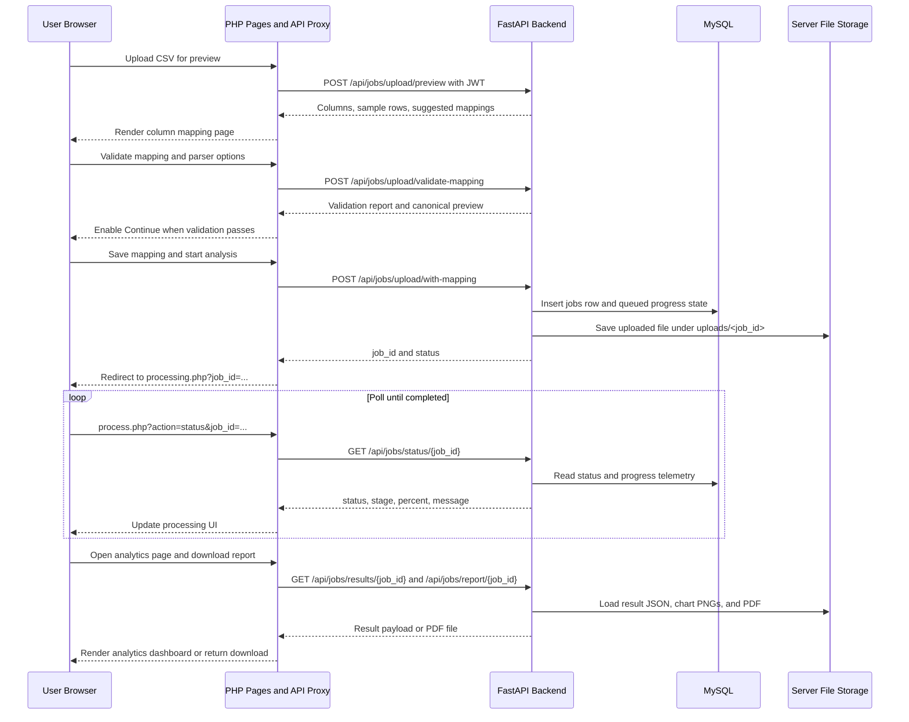
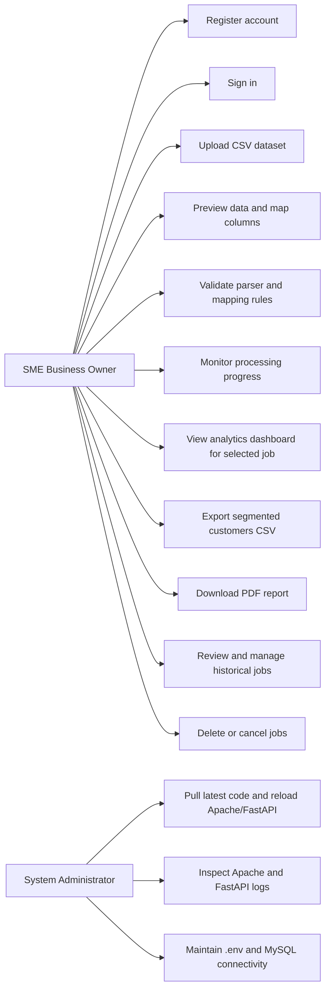
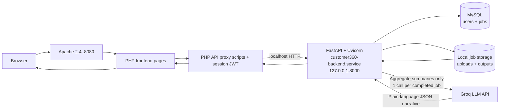
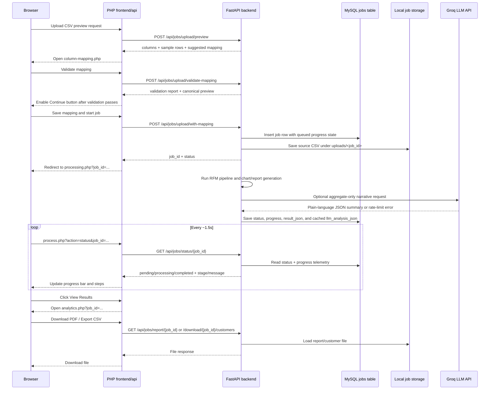
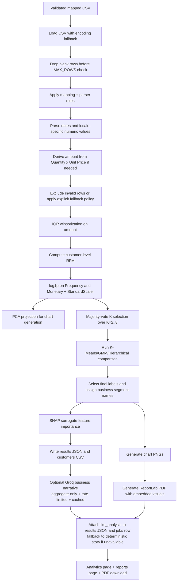

# Customer360 Capstone Paper Alignment Guide by Chapter

This document lists the report edits required to make the capstone paper consistent with the current Customer360 implementation and the deployed system at `http://64.23.248.187:8080/customer360/`.

The focus is not to rewrite the whole dissertation from scratch, but to identify where the paper still reflects an older system state and provide ready-to-paste replacement text, updated diagram code, and corrected table content.

## Latest Implementation Changes Reflected in This Guide

The following updates were added in the most recent development session and should now be reflected in the dissertation wording, screenshots, and explanation of results:

- Customer segment names now use simpler Groq-style labels directly in `backend/app/analytics/segmentation.py`, such as “Your Star Customers”, “Almost Regulars”, “Slipping Away Slowly”, “About to Forget You”, “Danger Zone”, “Sleeping Customers”, and “Gone Customers”. This removes less intuitive labels such as “Best Repeat Buyers” and “Customers Who Need a Follow-Up” from fresh jobs.
- The pipeline now disambiguates repeated segment names with suffixes such as “Group 1” and “Group 2” in `backend/app/analytics/pipeline.py`, and the segment descriptions explain why two groups with similar broad meaning were separated.
- The analytics dashboard now includes clickable `?` explanation popups on KPI cards and segment cards in `frontend/analytics.php`, and technical labels such as “Silhouette score” are no longer shown as the primary user-facing explanation. The dashboard now presents “Grouping confidence” in plain language instead.
- The dashboard customer table now colors segment badges using the segment’s base label when a group has a suffix such as “Group 1”, which keeps the UI styling consistent after segment-name disambiguation.
- The recent-runs table in `frontend/dashboard.php` now uses “Analysis type: Customer grouping”, “Customer groups”, and “Grouping confidence” instead of exposing raw model jargon such as `KMEANS` and “Silhouette” to non-technical users.
- The help page FAQ in `frontend/help.php` now explains the CSV-first mapping workflow and the required business fields in simpler language, and it no longer claims that Excel files are supported in the main guided upload branch.
- The PDF report generated by `backend/app/report.py` now explains the three buying signals in simpler language, includes plain-English segment descriptions, and avoids emoji in segment headings so ReportLab’s default PDF font does not risk broken glyphs.
- A Groq-powered “Business Coach Summary” layer has been added as an optional post-analysis narrative. The backend sends only aggregate, PII-free segment statistics to Groq, caches one response per completed job, applies app-side request throttling, uses a configurable 90-second Groq client timeout by default, and falls back safely to the deterministic story summary if Groq is unavailable or rate-limited.
- The Groq layer now uses the exact final segment names produced by the pipeline, including disambiguating suffixes such as “ - Group 1”, and its segment-level insights and actions are merged back into the segment objects and customer rows before `analytics.php` and the PDF report are rendered. This prevents the dashboard, report, and AI narrative from using conflicting customer-group names.
- The `analytics.php` customer-segment cards now expose aggregate-only segment statistics through `data-segment-index` attributes and browser-side globals (`window.__C360_SEGMENTS` and `window.__C360_META`) so `frontend/assets/js/ai_profiler.js` can inject a “Get AI Profile” button into each card. That script calls the authenticated PHP Groq proxy on demand and renders a plain-language segment profile inline without sending raw customer rows or personally identifying fields.
- The exported MySQL schema dump at `/Users/akuaoduro/Downloads/customer360-2.sql` contains four tables: `users`, `jobs`, `job_artifacts`, and `job_events`. The ERD and Chapter 4 database notes in this guide now reflect those auxiliary artifact/event tables, but they also explicitly note that the current SQLAlchemy model layer in `backend/app/models.py` defines only `User` and `Job`, so `job_artifacts` and `job_events` should be described as existing database-side operational/audit tables that are not currently surfaced as ORM entities in the FastAPI code.
- The reports history page now displays only the safe base filename using `basename(...)`, links completed report rows directly to `analytics.php?job_id=...`, and avoids exposing server-side upload paths in the table. The analytics page now hides the Export CSV and Download PDF buttons when no completed analysis result is loaded, and the upload page now uses a new RFM-friendly CSV template plus a non-bubbling Browse Files button that does not retrigger the drop-zone click handler.
- Segment cards on `analytics.php` now use Material Symbols icons such as `kid_star`, `favorite`, `trending_up`, and `warning` instead of emoji glyphs. Segmented customer CSV exports now keep one business-facing group label column (`segment`) and strip redundant/presentation-only fields such as `segment_base_label`, `segment_short_name`, `segment_emoji`, and `segment_icon`; the backend removes those fields from old saved CSV files at download time as well.
- A full standalone rewrite of the Architecture and Design chapter has been drafted in `docs/CHAPTER_3_ARCHITECTURE_AND_DESIGN_REWRITE.md`. That file restructures the chapter around the current deployed system, adds updated Mermaid architecture and sequence diagrams, and includes tables for design principles, page responsibilities, API proxy mappings, module responsibilities, database tables, and design-to-requirements traceability.
- A full standalone rewrite of the Implementation chapter has now been drafted in `docs/CHAPTER_4_IMPLEMENTATION_REWRITE.md`. That file rewrites the implementation story around the actual delivered stack, including the Apache/PHP public layer, the localhost FastAPI backend, the current CSV-first mapping workflow, the MySQL plus `job_artifacts` and `job_events` schema view, the optional Groq narrative layer, and the technologies or approaches that were narrowed or discontinued during delivery.
- The standalone implementation rewrite now includes explicit justification for the hybrid PHP + FastAPI architecture, the colocated localhost deployment model, the CSV-first guided workflow, MySQL plus local-file persistence, multi-algorithm comparison, and the decision to keep Groq optional. This was added to address the risk that an examiner could otherwise treat the mixed PHP/Python stack as arbitrary or unjustified.
- A full standalone rewrite of the Testing and Results chapter has now been drafted in `docs/CHAPTER_5_TESTING_AND_RESULTS_REWRITE.md`. That file reframes the chapter around the tests and evidence the current system can actually defend: pytest-based unit and API tests, live deployment regression checks, end-to-end workflow validation, report/export verification, documented fixes for failures discovered during testing, and a clear separation between completed evidence and still-pending work such as formal UAT and load testing.
- A new dissertation-ready testing chapter draft has now also been prepared in `docs/CHAPTER_5_TESTING_AND_RESULTS_FINAL_DRAFT.md`. This version is structured more explicitly around component testing, system-level testing, user-oriented validation, analysis of failures, and screenshot placement for website pages and report outputs, so it aligns more closely with the expected academic chapter format.
- The Chapter 5 final draft now also replaces raw local CSV file names with dissertation-friendly dataset labels such as “ThreeTwentyOne Retail Transactions Dataset” and “Austin Apparel Order History Dataset”, and it includes exact placement guidance for screenshots from the landing page, sign-in page, upload page, column-mapping page, processing page, analytics page, reports page, PDF output, and optional backend health verification.
- A shorter submission-focused Chapter 5 draft now also exists at `docs/CHAPTER_5_TESTING_AND_RESULTS_SUBMISSION_DRAFT.md`. This version is intentionally more compact, centers the chapter on successful component and system testing, uses the rerun automated result of 53 out of 53 passing tests, includes a concrete end-to-end Austin dataset smoke result, and keeps only the screenshot guidance and result-analysis sections most useful for final submission.
- A full standalone rewrite of the Requirements chapter has now been drafted in `docs/CHAPTER_2_REQUIREMENTS_REWRITE.md`. That file restructures the chapter around system overview, iterative project methodology, requirement-gathering methods, stakeholder and observation evidence tables, measurable functional and non-functional requirements, technical requirements, constraints, and a revised RTM. It also explicitly fixes two supervisor concerns: the old vague runtime requirement has been replaced with a measurable timing target, and the old unverifiable 99% uptime-style availability claim has been removed from the core requirement set.
- The standalone requirements rewrite now includes actual interview-derived themes and anonymised evidence tables based on SME conversations about WhatsApp- and spreadsheet-based record keeping, phone-number-based repeat-customer recognition, informal customer grouping, desire for targeted marketing, and preference for clear PDF-style outputs. This directly addresses the earlier critique that the requirement-gathering section described interviews and observations in general terms without showing what they produced.
- A supporting appendix file, `docs/APPENDIX_REQUIREMENTS_GATHERING_EVIDENCE.md`, has also been drafted so Chapter 2 can reference a fuller anonymised summary of stakeholder interview themes, representative quotations, and field observations without overloading the main requirements chapter.
- A dissertation-ready Chapter 2 draft has now also been prepared in `docs/CHAPTER_2_REQUIREMENTS_FINAL_DRAFT.md`. Unlike the rewrite guide, this version is written as continuous report prose and can be used more directly in the manuscript while still retaining the measurable NFRs, evidence tables, and revised RTM.
- The KPI card layout on `analytics.php` was widened from a seven-column desktop row into a more readable four-column grid with taller cards and better spacing around the `?` help icons, reducing crowding in the metrics row.
- Local validation was rerun using `Austin_Order_History-1.csv`; the smoke test completed successfully, generated a PDF report, and produced readable segment labels such as “About to Forget You” and “Your Star Customers”.

## Current System Baseline Used for This Review

The current system behaves as follows:

- Apache serves the public web application on port `8080`.
- The browser uses PHP pages in `customer360/frontend/` for the UI.
- PHP API scripts in `customer360/frontend/api/` act as a proxy layer between the browser-facing pages and FastAPI.
- FastAPI runs privately on the same server as a `systemd` service on `127.0.0.1:8000`.
- MySQL stores user accounts and job metadata.
- The exported MySQL schema also includes `job_artifacts` and `job_events` tables linked to `jobs.id` for artifact-path tracking and event/audit logging, but the current SQLAlchemy ORM code actively models only `users` and `jobs`.
- Uploaded CSV files are stored in `backend/data/uploads/<job_id>/`.
- Output files are stored in `backend/data/outputs/<job_id>/`, including result JSON, segmented customer CSV, chart PNGs, and ReportLab PDF reports.
- The current mapped web workflow is `Landing Page -> Sign In/Register -> Upload CSV -> Column Mapping + Validation -> Processing -> Analytics -> Download CSV/PDF`.
- The upload page now serves a dedicated sample CSV template named `rfm_customer_transactions_template.csv` whose headers align with the mapping page: `CustomerID`, `InvoiceDate`, `InvoiceNo`, `Quantity`, `UnitPrice`, optional `Amount`, `Description`, and `Category`.
- The deployed guided mapping flow currently supports CSV in the main preview/validation branch.
- The current pipeline can derive `amount = quantity * unit_price`, supports locale-aware parsing settings, excludes invalid rows, and exposes progress telemetry through the jobs table.
- The current `analytics.php` page displays KPI cards with clickable question-mark explainers, a plain-language story summary, feature-importance bars rewritten in simpler language, a tabbed gallery of generated chart PNGs, segment cards with explanation popups, a searchable and paginated customer table, and a collapsible data-quality summary.
- Each segment card on `analytics.php` can now request an additional “Get AI Profile” breakdown through `frontend/assets/js/ai_profiler.js`. The script uses only the page’s aggregate segment and meta summaries, calls `frontend/api/groq-insight.php`, and renders the returned lifestyle, buying-personality, channel, message, and offer suggestions directly inside the segment card.
- Segment names are now written in simpler business language, for example “Your Star Customers”, “Slipping Away Slowly”, “Danger Zone”, and “Gone Customers”. Fresh jobs no longer use “Best Repeat Buyers” or “Customers Who Need a Follow-Up” as the main labels.
- The current PDF report embeds generated chart PNGs, includes the pipeline-generated story summary in the executive-summary section, explains the customer groups and the three buying signals in simpler language, and formats currency as `GHS ...` to avoid the `GH₵` font rendering issue in ReportLab’s default Helvetica font.
- If `GROQ_API_KEY` is configured in `backend/.env`, the backend can generate one extra plain-English Groq narrative per completed job through `backend/app/analytics/groq_analysis.py`; that narrative is displayed on `analytics.php` and can be reused inside the PDF report without exposing raw customer IDs, names, emails, or phone numbers.

---

# Abstract

## What the paper currently says

The abstract says Customer360 is built with FastAPI, PHP, Tailwind CSS, and MySQL, runs RFM segmentation with K-Means, GMM, and Hierarchical Clustering, uses SHAP, and produces a dashboard and report. It also says that live deployment is incomplete and that user acceptance testing was designed but not executed.

## What is now outdated or inaccurate

The deployment limitation is no longer correct in its earlier form because the backend now runs on the live Ubuntu server behind Apache and PHP. The abstract also omits the newer preview and mapping-validation stage and still reads as if the user simply uploads a dataset and processing begins immediately. In addition, the paper should now mention that the main `analytics.php` page has been expanded beyond KPI and segment cards to include a story summary, a tabbed chart gallery, SHAP feature-importance bars, a searchable customer explorer, and a data-quality summary.

## Recommended change

Revise the abstract so it follows the expected one-page structure: first state the business problem, then summarize the proposed solution and system architecture, then report the high-level implementation and evaluation results with concrete metrics, and finally state the significance of the work for SMEs. Write the final abstract last, after Chapters 3 to 6 have been fully updated and the final benchmark and testing numbers are confirmed.

## Replacement paragraph / insertion text

Small and medium-sized enterprises often collect transactional sales data but lack an accessible software tool for converting those records into interpretable customer groups and marketing actions without specialist programming support. This project addresses that problem through Customer360, a web-based customer segmentation system that combines a PHP and Tailwind CSS user interface with a FastAPI analytics backend, a MySQL metadata store, and server-local storage for uploaded files, generated charts, segmented customer exports, and PDF reports. In the implemented workflow, users upload a CSV dataset, preview the detected columns, map the source fields to the required buying fields, and validate parser settings such as date format, decimal separators, and amount derivation rules before the analysis job begins. The Python backend then cleans the mapped data, derives transaction amount from quantity and unit price where needed, aggregates records to the customer level, computes buying-behaviour features, applies clustering-based segmentation and internal model evaluation, assigns plain-language business labels such as “Your Star Customers”, “Almost Regulars”, and “Danger Zone”, and estimates which buying signals most influenced the grouping using SHAP-based surrogate explainability. In the deployed system, Apache serves the public PHP application while FastAPI runs privately as a localhost service on the same Ubuntu server, allowing the frontend to retrieve live job progress, analytics summaries, segmented customer exports, and PDF reports with embedded visual charts. Evaluation on the final benchmark dataset should be reported here with concrete metrics such as number of processed transactions, number of customers segmented, selected cluster count, key validation scores, runtime, and successful end-to-end test outcomes [INSERT FINAL METRICS AFTER CHAPTER 5 IS UPDATED]. Overall, the project demonstrates that an SME-facing customer grouping workflow can be delivered as a practical hosted application with guided data mapping, automated reporting, and readable customer recommendations, while formal user acceptance testing, longer-term uptime monitoring, and stricter automated data-retention controls remain future work.

## Technical rationale

This version matches the current deployment topology, the current CSV preview and mapping flow, and the current storage design. It should now be updated to mention the richer `analytics.php` dashboard and the backend-generated story summary if you want the abstract to reflect the latest implementation.

## Notes for the author

- Write the final abstract last, after the implementation, testing, and conclusion chapters have been revised, so the summary does not freeze an intermediate system state.
- Keep the abstract to roughly one page and avoid low-level route names or file paths there; those belong in Chapters 3 and 4.
- Replace the bracketed metrics placeholder with the final benchmark and test numbers from Chapter 5. If you include runtime, benchmark it again on the live server using a named dataset size and report the number of usable rows and unique customers after preprocessing, not only the raw uploaded row count.

---

# Chapter 1: Introduction

## Sections that mostly remain valid

The following parts of Chapter 1 are mostly conceptual or literature-based and do not need major technical rewriting unless you want to improve grammar and flow:

- 1.1 Background
- 1.2 Problem Statement and Justification
- 1.5 Relevance of the Project
- 1.6 Conceptual Definitions
- 1.7 Empirical Issues

## Section 1.3 Aims and Objectives

### What the paper currently says

Objective 2 says the system applies K-Means, GMM, and Hierarchical Clustering and selects the best-performing algorithm using Silhouette Score. Objective 5 says the segmentation is delivered through a FastAPI, PHP, and MySQL web application and a Google Colab notebook.

### What is now outdated or inaccurate

The current FastAPI pipeline now chooses the number of clusters using a majority-vote approach across Elbow, Silhouette, Calinski-Harabasz, and Davies-Bouldin scores for `K = 2..8`. The mapped web flow now also sends `include_comparison = true` by default from the PHP request layer, which means the backend compares K-Means, GMM, and Hierarchical Clustering and selects the model with the strongest Silhouette Score for the chosen `K`. Therefore, the paper can now describe automatic multi-algorithm comparison as part of the default web workflow, while still noting that `K` itself is selected through majority voting across multiple internal metrics.

### Recommended change

Revise Objective 2 and the surrounding implementation description so it does not overstate automatic algorithm selection in the current web flow.

### Replacement paragraph / insertion text

Apply clustering-based customer segmentation using RFM features and evaluate candidate cluster structures with internal validation metrics. In the current Python pipeline, the optimal number of clusters is selected using a majority-vote strategy across the Elbow heuristic, Silhouette Score, Calinski-Harabasz Index, and Davies-Bouldin Index over a bounded range of candidate values. For the selected cluster count, the deployed web workflow now compares K-Means, Gaussian Mixture Model, and Hierarchical Clustering by default and applies the algorithm with the best Silhouette Score to generate the final customer segments.

### Technical rationale

This wording matches `pipeline.py`, `clustering.py`, and `frontend/api/mapping.php` more accurately than the older claim that the web application always selects the best algorithm automatically.

### Notes for the author

Retain the distinction between cluster-count selection and algorithm selection in the write-up: majority vote selects `K`, and Silhouette Score selects the best algorithm among the three compared models for that `K`.

## Section 1.4 Proposed Solution Approach

### What the paper currently says

Component A says users can upload CSV or Excel files and that a 16 MB limit is enforced. Component C says the system generates interactive segment distribution, radar, PCA, and feature importance charts. Component D says the PDF report includes SHAP explanations, statistical validation results, and a technical appendix.

### What is now outdated or inaccurate

The current guided preview and column-mapping path is CSV-first. `upload.php?action=preview` rejects Excel files in that branch, and the FastAPI backend currently allows only `.csv`. The PHP upload limit in the current code is 25 MB, while the FastAPI configuration sets `MAX_FILE_SIZE_MB = 50`, although backend row-count validation is enforced by `MAX_ROWS = 100000`. The PDF report now includes a title page, executive summary, a plain-language story paragraph, data overview, RFM tables, segment tables, a visual chart section, detailed segment profiles, and marketing recommendations, but it does not currently embed SHAP chart figures or a full technical appendix in `report.py`. The current `analytics.php` page now displays KPI cards, a story summary, SHAP feature bars, a tabbed chart gallery, expandable segment cards, a searchable and paginated customer table, and a collapsible data-quality summary.

### Recommended change

Revise Component A, Component C, and Component D.

### Replacement paragraph / insertion text

Component A provides the data upload, preview, and validation interface. In the current deployed workflow, users upload CSV transaction files, inspect a sample of the detected columns, and then map those columns to the required RFM fields before launching the analysis. The interface also allows users to define parsing rules such as date format, decimal and thousands separators, currency symbols, and the policy for handling negative amounts. Where a direct total amount column is not available, the user can derive monetary value from quantity and unit price. A 25 MB upload limit is currently enforced in the PHP layer, and the backend additionally applies a maximum row-count limit after blank rows have been removed.

Component C focuses on explainability and visual output generation. The backend computes SHAP-based surrogate feature importance values and generates static analysis charts such as PCA customer maps, segment size charts, buying-pattern distribution plots, Pareto revenue charts, radar charts, algorithm comparison charts, and violin plots. These chart artifacts are saved in the job output directory, exposed through an authenticated chart endpoint, displayed in a tabbed chart gallery on `analytics.php`, and embedded in the downloadable PDF report. The analytics dashboard also presents a plain-language story summary, KPI cards with question-mark explainers, expandable segment cards with plain-English group descriptions, feature-importance bars written in non-technical language, a searchable and paginated customer table, and a collapsible data-quality summary.

Component D provides automated report generation. After a job completes, the backend produces a ReportLab PDF report that includes a title page, executive summary, data overview table, RFM summary statistics, a segment comparison table, a dedicated visual analysis section with the generated chart images, detailed segment profiles, and marketing recommendations. Currency values are rendered as `GHS` text rather than the cedi symbol to avoid font rendering issues in the generated PDF.

### Technical rationale

These changes align the chapter with the current frontend upload flow, backend file-type support, current upload limits, and the actual contents of `report.py` and `analytics.php`.

### Notes for the author

The introduction can still describe Excel upload and richer dashboard charts as future enhancements, but should not present them as fully delivered in the deployed system unless the code is changed first.

---

# Chapter 2: Requirements

## Section 2.1 to 2.3 Stakeholders, Requirements Gathering, and Use Case Analysis

### What the paper currently says

The chapter identifies SME business owners, administrators, and business analysts or data officers as stakeholders, and uses a use case diagram to show registration, login, upload, column mapping, analysis monitoring, result viewing, and report download.

### What is now outdated or inaccurate

The broad stakeholder roles remain valid. The use case diagram, however, should be updated if it omits the new “Preview and Validate Column Mapping” step as a separate use case and if it still suggests direct browser-to-FastAPI interaction instead of a PHP-mediated web workflow.

### Recommended change

Revise Figure 2.1 and the use case text if the old diagram does not show preview/validation explicitly.

### Replacement paragraph / insertion text

In the current web workflow, the SME user does not move directly from file upload to model execution. Instead, the user first previews the uploaded dataset, reviews the detected columns, maps the required fields, and validates the parsing and cleaning rules before an analysis job is created. This validation step is an important part of the user interaction design because it allows business users to correct column-selection or formatting assumptions early, rather than discovering errors only after the backend job has failed.

### Technical rationale

The mapping-validation step is now implemented as a separate route flow through `api/upload.php?action=preview`, `api/mapping.php?action=validate`, and `api/mapping.php?action=save`, so it should appear in the use case model.

### Updated diagram: use case diagram

Paste this into Mermaid to generate the updated use case diagram.

## Section 2.4 Functional and Non-Functional Requirements

### What the paper currently says

The paper says the system shall allow CSV or Excel uploads, automatically validate uploaded datasets, display progress, and avoid permanently storing uploaded customer datasets unless required or explicitly approved.

### What is now outdated or inaccurate

The deployed guided mapping workflow currently supports CSV as the reliable live path. The storage/privacy requirement also needs correction: uploaded files and result artifacts are stored on the server filesystem under job-specific folders, and the database keeps job metadata plus an `is_saved` flag, but there is no automatic cleanup worker in the current code that deletes all unsaved jobs after a fixed retention period. Therefore the paper should not imply that files are deleted automatically after analysis unless this has actually been implemented.

### Recommended change

Revise FR001, FR002, and the storage-related NFR text.

### Replacement paragraph / insertion text

The current deployed system shall support CSV upload for the guided web-based segmentation workflow and shall validate the uploaded dataset through a preview, column mapping, and parser-configuration stage before the background analysis job begins. The system shall display live processing progress, stage labels, and completion status for each job, and shall allow the authenticated owner to retrieve results, download reports, and delete a job and its associated files. Uploaded files and generated outputs are currently retained in job-specific server directories to support report retrieval and repeated access, and this retention behaviour should be documented clearly as part of the current operational design.

### Technical rationale

This aligns the requirements chapter with the actual backend and frontend implementation and avoids making a privacy-retention claim that is stronger than what the code currently enforces.

### Notes for the author

If strict automatic deletion is required for the final report, that behaviour should be implemented first, likely through a scheduled cleanup process that deletes old unsaved jobs and their output directories.

## Section 2.6 Ethical Considerations

### What the paper currently says

The paper says SMEs should only upload lawful customer data, avoid unnecessary identifiers, and that uploaded data should be processed securely and deleted after analysis unless temporary storage is explicitly approved.

### What is now outdated or inaccurate

The ethical principle remains valid, but the implementation currently does store job files and outputs on the server after processing. Also, the mapping workflow allows optional synthetic customer/date fallback toggles, which means the paper should explain that those fallback modes reduce analytical fidelity and should be used carefully.

### Recommended change

Revise the data retention wording and add one paragraph on synthetic fallback transparency.

### Replacement paragraph / insertion text

Because the current implementation stores uploaded files and generated outputs in job-specific server directories so that users can revisit reports and exports, the data retention behaviour should be made explicit to users and managed through authenticated access controls and job deletion features. In addition, the column-mapping interface includes optional fallback settings for generating synthetic customer identifiers or invoice dates when the uploaded dataset is incomplete. These options can make the pipeline runnable on imperfect data, but they also reduce the meaning of true repeat-customer RFM analysis. For this reason, the system displays validation notices when such fallbacks are used, and the paper should present them as exceptional options rather than as the preferred analytical path.

### Technical rationale

This revision keeps the ethics chapter consistent with the actual storage and validation behaviour while preserving the data-protection intent of the manuscript.

---

# Chapter 3: Architecture and Design

## Section 3.2 System Architecture Design

### What the paper currently says

The paper explains the system as layered architecture with a user layer, presentation layer, processing layer, analysis layer, and storage layer. It says the PHP frontend provides the dashboard while FastAPI routes receive requests and run the analytical pipeline.

### What is now outdated or inaccurate

The current deployment has a more specific split: the browser talks to Apache-hosted PHP pages and PHP API proxy scripts, and those PHP scripts forward authenticated requests to FastAPI over localhost. FastAPI is not directly public in the normal deployed flow. The current design also includes an optional Groq-based narrative service that is called once after a job completes, stores the plain-language output in the job record and results JSON, and falls back to the deterministic story summary if Groq is unavailable or rate-limited. The architecture diagram should therefore show Apache/PHP, PHP API proxy/session handling, FastAPI on `127.0.0.1:8000`, MySQL, server-local file storage, and the external Groq API as a tightly controlled post-processing dependency fed only with aggregate, non-identifying segment statistics.

### Recommended change

Revise Figure 3.1 and the explanatory paragraph under system architecture.

### Replacement paragraph / insertion text

The deployed architecture of Customer360 uses a hybrid PHP and Python backend arrangement. Apache serves the public web interface on port `8080`, and the PHP pages provide the user-facing workflow and session management layer. When a protected action is performed, such as validating a column mapping, checking job status, retrieving analysis results, or downloading a report, the PHP API scripts attach the session token and forward the request to the FastAPI backend running privately on `127.0.0.1:8000`. FastAPI performs authentication and ownership checks, executes the segmentation pipeline in background jobs, stores job metadata, progress telemetry, and cached AI narrative fields in MySQL, and writes generated artifacts to server-local upload and output directories. After the statistical pipeline completes, the backend can optionally send only aggregate, non-personal segment summaries to Groq to produce one Ghana-SME-friendly business narrative, cache that narrative against the job, and reuse it in both the analytics dashboard and the PDF report. This structure keeps the browser-facing site simple, isolates computational processing in the Python service, and limits external AI calls to a controlled, privacy-preserving post-analysis step.

### Updated diagram: deployed system architecture

Paste this into Mermaid to generate the updated architecture diagram.

## Section 3.3 Data Ingestion and Validation

### What the paper currently says

The paper says the system accepts CSV or Excel files, automatically detects encoding, supports flexible column names, and may generate synthetic identifiers or dates if critical fields are missing.

### What is now outdated or inaccurate

The current guided web mapping path is CSV-first. The newer mapping page now exposes richer parser settings and a validation report before job creation. Most importantly, synthetic customer IDs and synthetic invoice dates are not generated silently by default; they are only allowed if the user explicitly enables those toggles. The paper should remove any wording that suggests missing customer IDs are automatically replaced by row indices in the standard RFM workflow, because that would turn the analysis into invoice-level segmentation rather than true repeat-customer RFM.

### Recommended change

Revise Section 3.3, Figure 3.2, and Table 3.2.

### Replacement paragraph / insertion text

The data ingestion stage now follows a two-step preview and validation workflow. After the CSV file is uploaded, the backend loads the file with fallback encoding support, removes fully blank rows, profiles each column, and returns suggested mappings and sample values to the frontend. The user then maps the required fields, selects whether amount should be read directly or derived from quantity and unit price, and specifies parsing options such as date format, decimal separator, thousands separator, currency symbol, and negative amount handling. A validation endpoint runs preprocessing on the temporary file and returns a summary of usable rows, excluded rows, customer count, invoice count, detected date range, total revenue, and warning notices. Only after this validation passes is a live analysis job created. Synthetic customer IDs or synthetic invoice dates are only generated if the user explicitly enables those fallback options, and the interface warns that such fallbacks weaken the interpretation of true customer-level RFM.

### Updated diagram: data ingestion and validation flow

Paste this into Mermaid to generate the updated ingestion diagram.

### Updated table: flexible mapping and parser rules

Use this to replace or expand the current mapping-rules table.

| Field / Setting | Required? | Current behaviour |
|---|---|---|
| Customer ID | Required unless synthetic customer IDs are explicitly enabled | Used to group transactions into customer-level RFM records |
| Invoice Date | Required unless synthetic invoice dates are explicitly enabled | Used to compute Recency against the max observed date plus one day |
| Invoice ID | Required | Used to count Frequency by distinct invoice IDs |
| Amount | Required in direct mode | Used as the transaction monetary value |
| Quantity + Unit Price | Required in formula mode | Amount is derived as `Quantity × Unit Price` |
| Product | Optional | Preserved as supporting metadata where available |
| Category | Optional | Used to infer a broad business type label |
| Date format | Optional | Allows explicit parsing where automatic date parsing may be ambiguous |
| Day-first flag | Optional | Controls how ambiguous dates such as `12/10/2023` are interpreted |
| Decimal separator / Thousands separator / Currency symbol | Optional | Supports locale-aware monetary parsing |
| Negative amount policy | Optional | Controls whether negative rows are excluded, kept, or converted |

## Section 3.4 Data Cleaning and Preprocessing

### What the paper currently says

The paper says exact duplicates are removed, missing amounts can be recomputed, rows missing critical identifiers are dropped, dates are parsed, negative values are removed, and missing categorical values are filled. It also says synthetic customer IDs may be generated from row index when a customer ID is missing.

### What is now outdated or inaccurate

The current preprocessing implementation removes fully blank rows before the row-limit check, derives amount in formula mode, supports locale-aware numeric conversion, and only allows synthetic identifiers or synthetic dates if explicit fallback flags are enabled. The “synthetic identifiers by default” statement is no longer accurate and should be removed from the standard preprocessing description.

### Recommended change

Revise the preprocessing subsection and Table 3.3.

### Replacement paragraph / insertion text

The preprocessing stage applies the user-approved mapping and parser settings to convert the uploaded CSV into a canonical transaction table for RFM computation. Fully blank rows are removed before enforcing the maximum row limit. Transaction dates are parsed either through an explicit user-selected format or a fallback automatic parser, and monetary fields are converted using the selected locale rules. If direct transaction amount is not provided, the system can derive it from quantity and unit price. Rows with missing required identifiers, missing dates, or invalid monetary values are excluded by default, and negative amounts are handled according to the selected refund policy. Synthetic customer IDs and synthetic invoice dates are treated as explicit fallback options rather than default behaviour, and the validation response reports when such fallbacks were used.

### Updated table: data cleaning and preprocessing operations

| Step | Operation | Rationale |
|---|---|---|
| 1 | Load CSV with UTF-8, Latin-1, or CP1252 fallback | Improves compatibility with SME exports |
| 2 | Drop fully blank rows before max-row validation | Prevents empty trailing spreadsheet rows from causing false file-size rejection |
| 3 | Apply user-selected column mapping and parser rules | Ensures the backend interprets each source column correctly |
| 4 | Parse invoice dates with explicit format or fallback parser | Supports accurate Recency computation |
| 5 | Parse monetary fields with decimal/thousands/currency rules | Prevents locale-specific numeric values from being misread |
| 6 | Derive `amount = quantity × unit_price` when formula mode is selected | Preserves useful datasets that do not contain a direct total amount column |
| 7 | Remove or transform negative amounts according to policy | Controls how refunds/returns affect Monetary |
| 8 | Exclude rows with missing required IDs/dates unless fallback is explicitly enabled | Protects true customer-level RFM semantics |
| 9 | Fill optional product/category gaps with default labels where relevant | Keeps non-critical metadata usable without blocking analysis |

## Section 3.5 Feature Engineering Using the RFM Framework

### What the paper currently says

The paper says Recency is based on days since last purchase, Frequency is number of transactions or invoices, Monetary is total transaction amount, and log transformation plus StandardScaler are applied before clustering.

### What is now outdated or inaccurate

This section is mostly correct, but it should explicitly state that the implementation computes Frequency as the number of unique invoice IDs per customer when the invoice column exists, otherwise it falls back to row counts. Recency is computed relative to the maximum observed invoice date plus one day by default. The paper should also correct the typographical error “K-Menas” to “K-Means”.

### Recommended change

Revise the RFM implementation paragraph for precision and fix the typo.

### Replacement paragraph / insertion text

In the current implementation, Recency is calculated as the number of days between a customer’s most recent invoice date and a reference date set to one day after the latest transaction date in the dataset. Frequency is computed as the number of distinct invoice IDs per customer when an invoice identifier is available, which avoids over-counting customers whose invoices contain multiple line items. Monetary is computed as the sum of the transaction amount values for each customer. Before clustering, Frequency and Monetary are transformed with `log1p` to reduce skewness, and the resulting RFM features are standardised with `StandardScaler` so that no single feature dominates the distance-based clustering process used by K-Means and the other algorithms.

## Section 3.6 Machine Learning Pipeline

### What the paper currently says

The paper says values of `K` from 2 to 10 are evaluated, the web application uses Silhouette Score as the main criterion while the Colab pipeline uses majority vote, and all three clustering methods are compared and the best method is selected automatically.

### What is now outdated or inaccurate

The current FastAPI pipeline evaluates `K` from 2 to 8 by default and uses majority vote across Elbow, Silhouette, Calinski-Harabasz, and Davies-Bouldin in the web backend too. The current PHP request layer now defaults `include_comparison` to `true`, so each mapped analysis request compares K-Means, GMM, and Hierarchical Clustering for the selected `K`, and the backend applies the method with the strongest Silhouette Score to the final segment assignment.

### Recommended change

Revise 3.6.1, 3.6.2, Table 3.5, and the surrounding model-selection explanation.

### Replacement paragraph / insertion text

The Python backend evaluates candidate cluster counts over the range `K = 2` to `8` using a majority-vote strategy across the Elbow heuristic, Silhouette Score, Calinski-Harabasz Index, and Davies-Bouldin Index. For larger datasets, the K-search is run on a fixed random subsample to reduce computation time while keeping the selection process stable. After the final `K` is chosen, the backend runs K-Means, Gaussian Mixture Model, and Hierarchical Clustering to generate comparison metrics, and the deployed PHP request layer now enables comparison mode by default so the backend selects the best-performing algorithm automatically for each mapped job.

### Technical rationale

This reflects `_find_optimal_k_majority_vote()` in `pipeline.py`, the default K range in `config.py`, and the `include_comparison = true` request defaults in `frontend/api/mapping.php` and `frontend/api/upload.php`.

### Notes for the author

Keep one nuance explicit in the manuscript: majority vote selects the cluster count `K`, then Silhouette Score selects the best algorithm among K-Means, GMM, and Hierarchical Clustering for that fixed `K`.

## Section 3.7 Explainability, Visualisation, and Reporting

### What the paper currently says

The paper says the web application displays interactive charts converted to JSON, SHAP feature importance rankings are displayed on the dashboard, and the PDF includes charts, SHAP explanations, statistical validation results, page headers, footers, and page numbers.

### What is now outdated or inaccurate

The current `analytics.php` page now renders a tabbed backend chart gallery, a SHAP feature-importance panel, a story summary, expandable segment cards, and a searchable paginated customer table, while still supporting PDF and CSV downloads through PHP proxy actions. The page also includes a Groq-generated “Business Coach Summary” card when a cached narrative is available for the job, with a deterministic fallback story retained when Groq is unavailable. Segment-specific Groq insights and actions are now matched back to the exact segment labels in the result payload and used inside the segment cards and customer table, while the metric cards are displayed in a wider four-column grid to avoid crowded headings and icons. The legacy `analysis.php` page still exists as a separate image-based results view, but the current “View Results” button on `processing.php` routes users to `analytics.php?job_id=...` as the primary dashboard. The PDF report in `report.py` now embeds generated chart PNGs and can reuse the Groq business narrative, segment-level interpretations, and action list if present, but it does not currently add SHAP chart figures, ANOVA tables, a technical appendix, or page numbers. It does include a footer note on the recommendations page and uses plain `GHS` text for currency.

### Recommended change

Revise 3.7.1, 3.7.2, 3.7.3, Table 3.9, Figure 3.5, and Figure 3.6 so they describe exactly what is currently rendered in `analytics.php`, `analysis.php`, and the generated PDF.

### Replacement paragraph / insertion text

The current backend computes SHAP-based feature importance values through a Random Forest surrogate model trained on the RFM feature matrix and the final cluster labels. These explainability values are included in the backend result payload and are shown on `analytics.php` as plain-language ranked feature bars rather than raw model jargon. Static chart artifacts are generated during the pipeline and saved in the job output directory, including PCA scatter plots, segment size charts, RFM distributions, Pareto charts, radar charts, algorithm comparison charts, and violin plots. These visual files are streamed to `analytics.php` through `process.php?action=chart` and are also embedded in the ReportLab PDF report through a dedicated visual-analysis section. In addition, the backend can generate one Groq-based business narrative after the job has completed by sending only aggregate segment statistics and data-quality summaries, never raw customer identifiers, names, emails, or phone numbers. The prompt now requires Groq to preserve each segment name exactly as produced by the pipeline and to return one recommendation object per exact segment label. The backend then merges those segment-level insights and actions into the corresponding segment rows and customer rows, so the dashboard cards, customer explorer, and PDF report all present the same final group names and recommendations. If the Groq request fails, returns mismatched entries, or hits a rate limit, the system continues to show the deterministic story summary and original segment actions, so the analytics workflow does not fail because of the AI narrative layer.

### Updated table: visualisation and reporting components

| Component | Current implementation | Notes |
|---|---|---|
| KPI, story, segment, and customer explorer UI | `frontend/analytics.php` | Shows seven KPI cards, story summary, SHAP bars, segment cards, chart tabs, full-table filtering/pagination, and export buttons |
| Image-based chart gallery | `frontend/analytics.php` + `frontend/api/process.php?action=chart` | Renders authenticated backend-generated PNG charts in the main results page |
| Static chart generation | `backend/app/analytics/pipeline.py` with Matplotlib/Seaborn | Saves chart PNGs into `backend/data/outputs/<job_id>/` |
| SHAP feature importance | `backend/app/analytics/pipeline.py` + `frontend/analytics.php` | Numeric importance values are computed in Python and displayed as ranked bars in the dashboard |
| Groq business narrative and segment actions | `backend/app/analytics/groq_analysis.py` + `backend/app/routes/jobs.py` + `frontend/analytics.php` + `backend/app/report.py` | Optional one-call-per-job plain-English summary plus per-segment advice generated from aggregate segment statistics only; Groq must preserve the exact pipeline segment names, and the backend merges those insights/actions back into segment and customer rows before dashboard/PDF rendering |
| PDF report generation | `backend/app/report.py` with ReportLab | Embeds chart PNGs, segment tables, and recommendations; uses `GHS` text for currency |

---

# Chapter 4: Implementation

## Section 4.1 Introduction

### What the paper currently says

The chapter says FastAPI handles backend services and analytics, PHP provides the frontend, MySQL stores data, Uvicorn runs the backend, and Tailwind CSS styles the frontend.

### What is now outdated or inaccurate

This is mostly correct, but the paper should state that PHP is also the API proxy/session bridge to FastAPI and that FastAPI runs as a localhost-only `systemd` service behind Apache in deployment.

### Recommended change

Revise the introduction paragraph.

### Replacement paragraph / insertion text

The implemented Customer360 system combines a PHP server-rendered frontend, a FastAPI analytics backend, and a MySQL database. In deployment, Apache serves the PHP pages publicly while FastAPI runs as a private `systemd` service on `127.0.0.1:8000`. PHP is responsible not only for rendering the user interface but also for storing the authenticated session token and forwarding protected API requests to FastAPI through server-side proxy scripts. FastAPI handles authentication, file validation, background segmentation jobs, result retrieval, and report generation, while MySQL stores user accounts, job metadata, and summary fields used by the dashboard and report pages.

## Section 4.2 Workflow A: SME Business Owner

### What the paper currently says

The workflow says users upload CSV/XLS/XLSX files, the backend validates encoding and columns, a `job_id` is returned, and the user is redirected to the processing page. It also says that after completion the user is automatically redirected to the dashboard.

### What is now outdated or inaccurate

The current web flow sends users to a preview and column-mapping page before a real job is created. The mapped flow is CSV-first. The processing page unlocks the “View Results” button when the job is complete, and that button now routes to `analytics.php?job_id=<job_id>`. The page is not currently doing a forced automatic redirect to the dashboard.

### Recommended change

Rewrite the file upload, progress monitoring, and results viewing steps.

### Replacement paragraph / insertion text

After signing in, the user uploads a CSV file through the upload page or dashboard upload modal. The system first sends the file to a preview endpoint and then opens the column mapping page, where the user confirms the required fields, optional metadata fields, and parser settings. When validation succeeds, the mapping is saved and a live analysis job is created. The user is then redirected to the processing page, which polls the job status endpoint and displays backend-driven progress percentages, stage names, and explanatory messages. Once the job reaches the completed state, the “View Results” button becomes active and opens the analytics page for that specific job.

## Section 4.3 Tools and Technologies

### What the paper currently says

The technology tables list FastAPI, Uvicorn, MySQL, SQLAlchemy, PHP, Tailwind CSS, Plotly.js, Matplotlib, Seaborn, Kaleido, Squarify, ReportLab, dotenv, pytest, pytest-asyncio, and httpx.

### What is now outdated or inaccurate

Several entries are now overstated or incomplete. The current `analytics.php` page does not rely on Plotly.js for its main cards/tables, and no Plotly script is loaded there. Most current chart generation in the backend is static PNG output from Matplotlib/Seaborn and embedded into ReportLab PDFs. `kaleido` is still listed in requirements but the current visible PDF chart path in `report.py` consumes saved PNGs from `pipeline.py` rather than exporting live Plotly figures. The frontend routing also depends on Apache and PHP cURL proxy requests, which should be mentioned explicitly.

### Recommended change

Revise Tables 4.1, 4.4, 4.7, and 4.8.

### Replacement paragraph / insertion text

The web frontend is implemented as PHP-rendered pages styled with Tailwind CSS and enhanced with lightweight browser-side JavaScript for upload handling, mapping validation, job-status polling, chart-tab switching, and customer-table searching, filtering, and pagination. PHP sessions store the backend access token, and PHP cURL requests are used to forward protected API calls to the FastAPI service. On the analytics side, the backend uses Pandas, NumPy, scikit-learn, SHAP, Matplotlib, Seaborn, and ReportLab to compute segmentation results, save static chart images, and generate PDF reports. The current `analytics.php` dashboard renders backend-generated chart PNGs through a PHP proxy and does not rely on Plotly.js for the primary results view.

### Corrected table: selected implementation technologies that changed

| Layer | Current technology | Correction to the paper |
|---|---|---|
| Web server | Apache 2.4 | Mention Apache explicitly as the public server on port 8080 |
| FastAPI runtime | Uvicorn under `customer360-backend.service` | Mention `systemd` service management and localhost-only binding |
| PHP backend bridge | PHP cURL + PHP sessions | Make clear that PHP forwards requests to FastAPI and stores the JWT in session state |
| Main analytics dashboard | `analytics.php` story/cards/chart tabs/SHAP bars/customer explorer + export buttons | Do not describe this page as Plotly-driven; charts are backend-generated PNGs streamed through PHP |
| Backend charts | Matplotlib/Seaborn PNGs from `pipeline.py` | These are the chart artifacts embedded in the PDF report |
| PDF reporting | ReportLab | Report now includes a dedicated chart section and uses ASCII `GHS` currency text |

## Section 4.4 Implementation Techniques

### What the paper currently says

The paper says K is tested from 2 to 10, the web app uses Silhouette Score as the main K criterion, all three algorithms are compared and the highest Silhouette method is selected, and SHAP explains the segmentation.

### What is now outdated or inaccurate

The current FastAPI pipeline tests `K = 2..8` by default and uses majority vote across four metrics. The mapped web flow now enables comparison mode by default, so the final algorithm is selected from K-Means, GMM, and Hierarchical Clustering using Silhouette Score for the chosen `K`. SHAP is computed numerically and is now surfaced on `analytics.php` as ranked feature-importance bars, while the PDF report currently presents the story summary and chart pages rather than SHAP figures.

### Recommended change

Revise 4.4.3 to 4.4.7.

### Replacement paragraph / insertion text

In the current FastAPI implementation, the optimal cluster count is selected over the range `2` to `8` using a majority vote across the Elbow heuristic, Silhouette Score, Calinski-Harabasz Index, and Davies-Bouldin Index. For large datasets, the K-selection stage is evaluated on a fixed subsample to reduce runtime. The backend then runs K-Means, GMM, and Hierarchical Clustering to obtain comparison metrics, and the deployed mapped web flow now enables comparison mode by default so the method with the strongest Silhouette Score is selected automatically. After clustering, segment names, plain-language descriptions, and recommendations are assigned from RFM profile rules, a customer story summary is generated, customer-level export rows are enriched with lifecycle and risk fields, and a Random Forest surrogate model is trained on the normalized RFM features so that SHAP can estimate feature importance values for segment assignment.

### Updated diagram: end-to-end pipeline execution

Paste this into Mermaid to generate the updated Figure 4.1.

## Section 4.5 Database Design

### What the paper currently says

The paper describes a `users` table and a `jobs` table, and lists the jobs fields as status, error message, file path, output path, clustering settings, mapping JSON, summary metrics, timestamps, and `is_saved`.

### What is now outdated or inaccurate

The current exported database dump is broader than the two-table schema described in the manuscript. In `/Users/akuaoduro/Downloads/customer360-2.sql`, the database contains `users`, `jobs`, `job_artifacts`, and `job_events`. The `jobs` table also includes `progress_percent`, `progress_stage`, `progress_message`, `local_upload_path`, `storage_provider`, `storage_bucket`, `storage_object_path`, `storage_public_url`, `result_json`, `llm_analysis_json`, `llm_generated_at`, and `llm_status`. The dump also defines indexes on frequently queried fields such as `jobs.job_id`, `jobs.user_id`, `jobs.status`, `jobs.created_at`, and composite user/status/date keys, plus foreign keys from `jobs.user_id` to `users.id` and from `job_artifacts.job_id` and `job_events.job_id` to `jobs.id`, all with `ON DELETE CASCADE`. However, the current SQLAlchemy model layer in `backend/app/models.py` defines only `User` and `Job`; it does not currently define ORM classes for `job_artifacts` or `job_events`. The paper should therefore distinguish between the deployed SQL schema and the subset of tables that are actively represented in the current FastAPI ORM layer. The paper should also mention that a schema-migration helper in `database.py` adds missing `jobs` columns for existing deployed tables at startup.

### Recommended change

Revise Table 4.15 and the jobs-table explanation.

### Replacement paragraph / insertion text

The current MySQL schema is centered on the `users` and `jobs` tables, but the exported database dump also includes two job-linked support tables: `job_artifacts` and `job_events`. The `jobs` table now functions not only as a record of completed analyses but also as the state store for live processing feedback. In addition to the original job metadata and result summary fields, each row stores the current progress percentage, pipeline stage, user-facing progress message, cached result JSON, cached Groq narrative JSON, Groq generation timestamp, and Groq status so that the processing and analytics pages can poll and display live backend updates and reuse one AI narrative per completed job. The table also records the server-local upload path, the output directory, and optional storage metadata fields. The `job_artifacts` table stores file-oriented metadata for job outputs and source uploads, including artifact type, storage location, local path, MIME type, file size, and creation time, while `job_events` stores timestamped lifecycle/audit events with a JSON payload. All three job-related tables are configured to cascade-delete dependent rows when the parent user or job is removed. During application startup, the backend checks for missing `jobs` columns and adds them where needed so that older deployed schemas can be brought in line with the current model without manually recreating the database. Because `backend/app/models.py` currently defines only the `User` and `Job` ORM classes, the dissertation should avoid claiming that `job_artifacts` and `job_events` are exposed as first-class SQLAlchemy entities unless those models are added later.

### Updated diagram: current ERD

Paste this into Mermaid to generate the updated database ER diagram.

### Updated table: database fields and tables that must be added to the manuscript

#### `jobs` fields that are missing from the older manuscript

| Column | Purpose |
|---|---|
| `progress_percent` | Stores live percentage completion for the processing page |
| `progress_stage` | Stores the current pipeline stage such as `cleaning`, `rfm`, `charts`, or `completed` |
| `progress_message` | Stores the human-readable backend status message shown in `processing.php` |
| `local_upload_path` | Stores the server-local source file path used by the background worker |
| `storage_provider`, `storage_bucket`, `storage_object_path`, `storage_public_url` | Optional storage metadata fields that usually remain null in the current local-storage deployment |
| `result_json` | Optional cached result payload used by the backend |
| `llm_analysis_json` | Cached Groq or fallback narrative JSON reused by analytics and report generation |
| `llm_generated_at` | Timestamp showing when the one-per-job AI narrative was generated |
| `llm_status` | Records whether the narrative came from Groq, fallback logic, was skipped, or was rate-limited |

#### `job_artifacts` table from the SQL dump

| Column | Purpose |
|---|---|
| `id` | Auto-increment artifact row ID |
| `job_id` | Foreign key to `jobs.id`; deleted automatically when the parent job is deleted |
| `artifact_type` | Labels the kind of stored artifact, for example `source_upload` or `output_directory` |
| `storage_provider`, `storage_bucket`, `object_path`, `public_url` | Optional object-storage metadata |
| `local_path` | Server-local path for the stored source file or generated output directory |
| `mime_type` | Optional content type metadata for file artifacts |
| `file_size_bytes` | Optional file-size metadata |
| `created_at` | Artifact registration timestamp |

#### `job_events` table from the SQL dump

| Column | Purpose |
|---|---|
| `id` | Auto-increment event row ID |
| `job_id` | Foreign key to `jobs.id`; deleted automatically when the parent job is deleted |
| `event_type` | Job lifecycle or audit event label, for example `created` or `queued` |
| `event_payload` | JSON payload containing event details |
| `created_at` | Event timestamp |

### Notes for the author

- If the dissertation includes an implementation-level ORM discussion, state clearly that `backend/app/models.py` currently exposes only `users` and `jobs` as SQLAlchemy models, even though the SQL dump contains `job_artifacts` and `job_events`.
- If you want the codebase and the schema dump to be fully aligned at the ORM layer, add `JobArtifact` and `JobEvent` SQLAlchemy models later and then update this section again.
- The SQL dump currently includes index definitions for `job_id`, `user_id`, `status`, `created_at`, `storage_object_path`, artifact type/provider/object path, and event type/date fields. Those indexes are worth mentioning briefly if Chapter 4 discusses query performance or job-history filtering.

## Section 4.6 Backend API Implementation

### What the paper currently says

The paper describes authentication endpoints, upload, status, results, report download, and access control.

### What is now outdated or inaccurate

The route names and request path descriptions should be updated to match the current FastAPI app. The paper should also explain that PHP proxy scripts mediate browser requests and that the preview and validate-mapping endpoints are now part of the workflow.

### Recommended change

Revise 4.6.2 and any endpoint tables.

### Replacement paragraph / insertion text

The current job-management API includes separate routes for previewing an uploaded CSV, validating a proposed column mapping, launching a mapped analysis job, polling job status, retrieving final results, downloading the generated PDF report, exporting the segmented customer CSV, saving a job, deleting a job, and cancelling a job. In the deployed web application, these FastAPI routes are not called directly by the browser. Instead, PHP proxy scripts under `frontend/api/` receive the browser request, read the JWT from the PHP session, forward the request to the FastAPI endpoint, and return the response to the frontend page.

### Corrected endpoint table

| Function | PHP proxy route | FastAPI route |
|---|---|---|
| Register/Login/Logout | `frontend/api/auth.php` | `/api/auth/register`, `/api/auth/login/json`, `/api/auth/logout`, `/api/auth/me` |
| Upload preview | `frontend/api/upload.php?action=preview` | `/api/jobs/upload/preview` |
| Validate mapping | `frontend/api/mapping.php?action=validate` | `/api/jobs/upload/validate-mapping` |
| Save mapping and start job | `frontend/api/mapping.php?action=save` | `/api/jobs/upload/with-mapping` |
| Poll job status | `frontend/api/process.php?action=status&job_id=...` | `/api/jobs/status/{job_id}` |
| Load final results | `frontend/api/process.php?action=results&job_id=...` | `/api/jobs/results/{job_id}` |
| Download PDF | `frontend/api/process.php?action=report&job_id=...` | `/api/jobs/report/{job_id}` |
| Export customers CSV | `frontend/api/process.php?action=customers&job_id=...` | `/api/jobs/download/{job_id}/customers` |

### Updated diagram: request sequence for mapped upload and results

Paste this into Mermaid to update the manuscript sequence diagram.

## Section 4.7 Frontend Implementation

### What the paper currently says

The paper says Plotly.js is used to display interactive charts on analysis pages, public pages include landing/register/sign-in, authenticated pages include upload, column mapping, processing, dashboard, analytics, reports, and help, and the analytics page shows segment summary cards, distribution charts, RFM visualisations, and feature importance displays.

### What is now outdated or inaccurate

The current `frontend/index.html` is the landing page, and root `/customer360/` now redirects to that file through `customer360/index.php`. The `analytics.php` page now renders seven KPI cards, a plain-language customer-story panel, a tabbed gallery of backend-generated charts, SHAP feature-importance bars, expandable segment cards, a searchable and paginated customer table, and a collapsible data-quality summary. CSV and PDF exports are routed through `frontend/api/process.php`, and chart PNGs are streamed through `process.php?action=chart`. The page does not currently use Plotly.js for this primary dashboard.

### Recommended change

Revise 4.7.1, 4.7.2, 4.7.3, and the caption/description for Figure 4.9.

### Replacement paragraph / insertion text

The public root path of the deployed site now redirects to the landing page in `frontend/index.html`, providing a cleaner entry point than an Apache directory listing. Authenticated workflow pages remain implemented in PHP, and the core workflow is now `upload.php -> column-mapping.php -> processing.php -> analytics.php`. The processing page displays backend-driven progress updates and unlocks the “View Results” button when the job completes. The current `analytics.php` page presents seven KPI cards, a plain-language story summary, a tabbed chart gallery, SHAP ranking bars, expandable segment cards, a full searchable customer explorer, a data-quality summary, and buttons for exporting the full segmented customer CSV and downloading the generated PDF report for the selected `job_id`.

### Notes for the author

If you intend `analytics.php` to be the main final results page in the dissertation screenshots, retake Figure 4.9 from the current `analytics.php?job_id=...` view and describe it as a summary analytics dashboard rather than a full Plotly dashboard.

---

# Chapter 5: Testing and Results

## Section 5.1 and 5.2 Testing Strategy

### What the paper currently says

The chapter describes unit testing, component testing, system integration testing, and planned user acceptance testing. It says integration testing covers upload, mapping, preprocessing, RFM, clustering, report generation, and persistence.

### What is now outdated or inaccurate

The test discussion should be expanded to include recent bugs and fixes that are now important to the current system: mapping validation route correctness, `result_json` schema migration, progress-page navigation to `analytics.php`, ReportLab duplicate style-name failure, chart embedding in generated PDFs, NaN-safe JSON serialization in `/api/jobs/results/{job_id}`, and root `/customer360/` redirect behaviour. The paper should also be careful not to claim that every new frontend workflow and every current backend route is covered by automated tests unless those tests have been added and rerun.

### Recommended change

Revise Chapter 5 test tables and the discussion of results to include current deployment and regression checks, and soften any fixed test-count claim that may no longer reflect the latest code.

### Replacement paragraph / insertion text

In addition to the original unit, component, and integration tests, recent deployment regression checks were carried out to verify that the hosted PHP frontend and the server-local FastAPI backend remain correctly connected. These checks included confirming that `/customer360/` redirects to the landing page, the FastAPI health endpoint returns a successful response on localhost, the column-mapping validation route returns a structured validation report, completed jobs can be opened from the processing page on the analytics dashboard, result payloads do not fail JSON serialization when non-finite numeric values appear, and generated PDF reports include embedded chart images with correctly rendered `GHS` currency values. These checks strengthened confidence in the deployed workflow, but formal user acceptance testing and broader concurrent load testing should still be completed before the system is described as fully production-ready.

### Updated table: new regression tests that should be added to Chapter 5

| Test area | What to verify | Expected result |
|---|---|---|
| Root entrypoint | `GET /customer360/` | Redirects to `frontend/index.html` |
| Backend health | `GET /health` on localhost FastAPI | Returns healthy JSON response |
| Mapping validation | `POST mapping.php?action=validate` | Returns `success=true` and validation metrics |
| Mapped job creation | `POST mapping.php?action=save` | Returns `job_id`, `status`, and processing redirect |
| Progress to analytics navigation | Click View Results on completed processing page | Opens `analytics.php?job_id=<job_id>` |
| Full customer CSV export | Click Export CSV on a completed analytics page | Downloads the backend-generated customer CSV with enriched segment, risk, and lifecycle fields |
| Analytics chart proxy | Switch chart tabs on `analytics.php` | Chart PNGs stream through `process.php?action=chart` and render successfully |
| PDF report rendering | Download report for a completed job | PDF contains segment tables, embedded chart pages, and readable `GHS` currency |
| NaN-safe result API | `GET /api/jobs/results/{job_id}` where metrics contain non-finite values | Response serializes successfully with `null` replacing invalid floats |

## Section 5.3 Test Data and 5.4 Test Tools

### What the paper currently says

The paper says the main dataset is the ThreeTwentyOne SME dataset, with synthetic datasets for unit and integration testing, and mentions SQLite in-memory databases for automated tests while MySQL is used in production.

### What is now outdated or inaccurate

That broad claim remains mostly valid, but if the manuscript references a specific number of customer rows, transaction rows, or a specific test-pass count, those values should be rechecked against the current test suite and current dataset after preprocessing. Also, the current live system’s most visible manual regression testing has been performed directly on the deployed Apache/PHP/FastAPI stack, not only through pytest and Docker.

### Recommended change

Revise any exact benchmark numbers and test-count claims unless they have been rerun recently.

### Notes for the author

If final dissertation submission requires evidence screenshots, include at least one screenshot of the live `processing.php` page at completion, one `analytics.php?job_id=...` result view, one generated PDF chart page, and one terminal output showing `systemctl is-active customer360-backend` plus a passing `/health` request.

---

# Chapter 6: Conclusions and Recommendations

## What the paper currently says

The chapter says Customer360 is a working first version but is not yet fully ready for live use because deployment issues remain unresolved, live API testing was difficult, and uptime in a real deployment has not yet been confirmed.

## What is now outdated or inaccurate

The statement that deployment issues remain unresolved is no longer accurate in that exact form. The current application is deployed on the Ubuntu server with Apache serving the PHP frontend and a `customer360-backend` service running FastAPI locally. Several deployment issues were fixed, including moving the Python backend onto the server, rerouting PHP to `127.0.0.1:8000`, fixing job status authorization/session handling, adding missing schema columns, fixing ReportLab style collisions, embedding report charts, correcting currency rendering, and making `/customer360/` redirect cleanly to the landing page.

## Recommended change

Replace the old deployment limitation paragraph with a more balanced statement that acknowledges current deployment success while keeping future-work items that are still true.

## Replacement paragraph / insertion text

The current version of Customer360 has moved beyond the earlier deployment limitation and is now running as a hosted web application in which Apache serves the PHP interface and the FastAPI backend runs privately on the same Ubuntu server. This resolves the earlier problem of unstable backend reachability and allows the deployed frontend to communicate with the analytical pipeline through a controlled local proxy route. At the same time, the system should still be regarded as a first production-facing version rather than a fully mature enterprise platform. Formal user acceptance testing remains necessary, long-duration uptime and concurrent load behaviour have not yet been fully evaluated, and the current local file-retention model should be strengthened with a clearer automated cleanup and data-retention policy in future work.

## Technical rationale

This wording prevents the conclusion from contradicting the present deployment state while still preserving a realistic academic discussion of remaining operational limitations.

## Notes for the author

Future work should probably separate “already fixed deployment issues” from “remaining production hardening tasks,” especially HTTPS/TLS, automated backup, scheduled deletion of old job artifacts, richer dashboard visualizations, and fuller UAT.

---

# Figures, Tables, and Diagrams That Should Be Replaced or Revised

## Must update

| Item | Why it needs revision |
|---|---|
| Figure 2.1 Use Case Diagram | Should include preview/mapping validation and current job/result flows |
| Figure 3.1 System Architecture Diagram | Must show Apache/PHP proxy + FastAPI localhost service + MySQL + local file storage + optional Groq narrative call with aggregate-only data |
| Figure 3.2 Data Ingestion and Validation Flow | Must show upload preview, column profiling, mapping validation, then mapped job creation |
| Figure 3.5 End-to-End Sequence | Should show browser -> PHP proxy -> FastAPI -> MySQL/filesystem -> processing -> analytics |
| Figure 3.6 PDF Report Download | Should reflect PHP proxy requesting `/api/jobs/report/{job_id}` and FastAPI returning ReportLab PDF |
| Figure 4.1 End-to-End Pipeline Execution | Must reflect blank-row removal, parser rules, winsorization, progress telemetry, chart PNG generation, PDF assembly |
| Figure 4.2 ER Diagram | Must include current `jobs` fields such as `progress_*`, storage metadata, `local_upload_path`, `result_json`, `llm_analysis_json`, `llm_generated_at`, and `llm_status` |
| Figure 4.6 Column Mapping Page | Retake from the current UI with parser controls, required-field markers, help popups, and validation report |
| Figure 4.7 Processing Page | Retake from the backend-driven progress UI with completed-state View Results button |
| Figure 4.9 Analytics Page | Retake from the current `analytics.php?job_id=...` page and describe it as summary analytics cards/tables, not a full Plotly dashboard |
| Table 3.2 Mapping Rules | Expand to include parser controls, formula amount mode, and fallback toggles |
| Table 3.3 Preprocessing Operations | Remove “synthetic IDs by default” and add blank-row cleanup + locale-aware numeric parsing |
| Table 3.4 / 4.10 K Selection Metrics | Update K range to 2..8 and majority vote across Elbow + Silhouette + CH + DB |
| Table 4.15 Jobs Table Schema | Add progress telemetry, storage metadata fields, and `result_json` |
| Chapter 5 API/Integration Test Tables | Add mapping validation, PDF chart embedding, NaN-safe results, root redirect, and processing-to-analytics navigation tests |
| Chapter 5 AI Narrative Tests | Add one test proving Groq output is cached once per job, one test proving fallback still renders when Groq is disabled/rate-limited, and one privacy check confirming only aggregate segment statistics are sent |

## Should verify before changing

| Item | What to check first |
|---|---|
| Any claim that all three clustering algorithms are automatically selected in the web app | This is now true in the mapped flow because PHP defaults `include_comparison` to `true`; keep the majority-vote `K` selection step separate in the write-up |
| Any claim that `analytics.php` renders interactive Plotly charts and SHAP panels | The page now renders backend-generated chart tabs and SHAP ranking bars, but not Plotly charts |
| Any claim that uploaded files are deleted automatically unless saved | Current code supports delete endpoints and an `is_saved` flag, but no scheduled cleanup worker is visible |
| Any claim that Excel files are fully supported in the guided web upload flow | Current preview/mapping flow is CSV-first, and FastAPI `ALLOWED_EXTENSIONS` is `.csv` |
| Any fixed pipeline runtime number | Must be re-benchmarked on the current server and current datasets |
| Any claim that Groq receives raw transaction rows or customer identifiers | The implemented Groq layer should be described as aggregate-only, PII-free, one call per completed job, and cached in the `jobs` table plus `results.json` |

---

# Paste-Ready Diagram Set

## Diagram 1: Current use case model

Paste this into Mermaid to generate the updated use case diagram.

## Diagram 2: Current deployed architecture

Paste this into Mermaid to generate the updated architecture diagram.

## Diagram 3: Current mapped upload and processing lifecycle

Paste this into Mermaid to generate the updated request lifecycle diagram.

## Diagram 4: Current analytics pipeline

Paste this into Mermaid to generate the updated pipeline diagram.

## Diagram 5: Current database ERD

Paste this into Mermaid to generate the updated ER diagram.

---

# Practical Author Feedback

My recommendation is to revise the paper in this order:

1. Chapter 3 architecture and pipeline sections first, because those sections define the system model and many later chapters depend on them.
2. Chapter 4 implementation and database/API sections next, because they contain the densest implementation drift.
3. Chapter 5 testing and Chapter 6 limitations after that, so the evaluation discussion reflects the fixed deployment and the bugs that were recently corrected.
4. The Abstract and Chapter 1 objectives last, so they summarize the final revised implementation rather than an intermediate version.

The biggest paper-system consistency risks right now are these:

- The manuscript still overstates Excel support in the deployed guided web flow.
- The manuscript may still describe algorithm selection as Silhouette-only or K-Means-only. Update that wording so it says majority vote selects `K`, then the default web flow compares K-Means, GMM, and Hierarchical Clustering and picks the strongest Silhouette method for that `K`.
- The manuscript may still describe `analytics.php` as Plotly-driven. The current dashboard uses backend-generated PNG chart tabs, SHAP ranking bars, story text, and a paginated customer explorer instead of Plotly.js.
- The manuscript understates deployment completion if it still says the backend is not live.
- The manuscript overstates automatic post-analysis data deletion if it says unsaved uploads are always removed, because no scheduled cleanup worker is currently evident in the code.
- The manuscript may now understate the optional AI narrative layer if it does not explain that Groq is called once after job completion, receives only aggregate non-identifying segment summaries, stores the response in `llm_analysis_json` and `results.json`, and is never allowed to block the main analytics pipeline when rate limits or API errors occur.
- The manuscript may now understate the deployed MySQL schema if it still presents only `users` and `jobs`. The exported dump also contains `job_artifacts` and `job_events`, so Chapter 4 and the ERD should either include those tables or explicitly explain why the write-up focuses on the two ORM-backed tables only.
- The Chapter 5 submission draft should now refer to the user-facing verification section as **User Acceptance Testing**, not merely “user-oriented validation,” so that it maps more directly to the dissertation rubric while still describing the same guided upload, mapping, interpretation, and export workflow.
- The Chapter 5 submission draft now uses a broader Table 5.7 issue-resolution summary that reflects the actual final system history more accurately, including the root-entry redirect, guided upload and column-mapping flow, progress telemetry, PDF visual/report fixes, clearer segment naming, Groq-assisted narrative integration, cleaned CSV exports, and safer report-history presentation.
- The landing page feature section should describe only capabilities that exist in the shipped system. Unsupported marketing cards such as sales forecasting, inventory optimisation, SMS integration, and loyalty tracking should be replaced with the actual workflow features: customer segmentation, column mapping and validation, live job tracking, analytics dashboard, plain-language insights, and report/CSV export history.

If you want, the next step should be to start with Chapter 3 and turn each section above into final dissertation-ready replacement paragraphs and final updated captions one by one.
