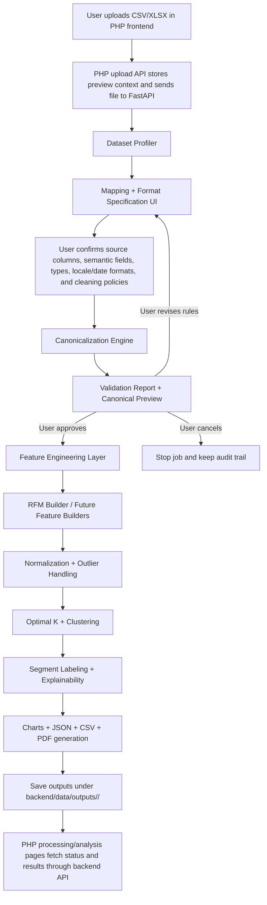
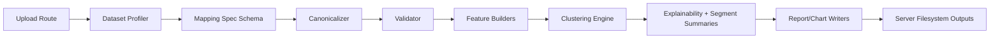

# Customer360 Pipeline Redesign Prompt

## Purpose
Use this prompt as the implementation blueprint for a more intelligent, modular, and user-guided customer-data pipeline.

The current pipeline is useful, but it assumes a mostly standard transaction dataset and relies too much on automatic parsing. The new design should keep the successful RFM + clustering + reporting workflow, but add a strong **schema mapping + data type/format normalization + validation** layer before analysis starts.

## Core Product Goal
When a user uploads a dataset, the system should not jump directly into analysis using guessed assumptions. Instead, the product should:

1. Profile the uploaded file.
2. Show a rich column-mapping and format-mapping UI.
3. Let the user explicitly tell the system which columns mean what and how they are formatted.
4. Convert the raw file into a canonical internal schema.
5. Validate that conversion and show a preview/report.
6. Run customer segmentation on the canonical dataset.
7. Save all outputs on the server under `backend/data/outputs/<job_id>/`.

---

# Prompt To Build The Better Pipeline

You are improving the Customer360 analytics backend and frontend upload flow.

Build a production-quality, modular customer-data pipeline that supports diverse business datasets from different users, regions, and formatting conventions. The pipeline must preserve the current customer segmentation outcome, but make the ingestion and preprocessing stage much more explicit, resilient, auditable, and user-controlled.

## What Must Change

### 1. Introduce a formal dataset profiling stage
After upload, inspect the file and return a structured profile for each column:
- column name
- detected data type candidates
- sample values
- null rate
- uniqueness ratio
- likely business semantic candidates such as `customer_id`, `transaction_date`, `transaction_id`, `amount`, `product`, `category`, `quantity`
- confidence score for each semantic guess
- likely date format candidates if the column looks like a date
- likely numeric locale candidates if the column looks like money or quantity

Do not assume one locale. A monetary value like `1.234,54` and `1,234.54` must be distinguishable.

### 2. Replace “simple column mapping” with “schema + format mapping”
The frontend mapping screen should ask not only “which column is amount?” but also “how should that amount be parsed?”

For each mapped field, the user should be able to define:
- source column
- target semantic field
- data type
- date format if date-like
- decimal separator and thousands separator if numeric-like
- currency symbol or ISO currency code if monetary
- negative-value policy for amounts
- missing-value policy
- duplicate handling policy where relevant

### 3. Build a canonicalization layer
Create a dedicated backend transform layer that converts raw columns into one internal canonical schema before RFM or clustering runs.

Example target schema:
- `customer_id` as string
- `invoice_id` as string
- `invoice_date` as timezone-normalized timestamp/date
- `amount` as decimal/float in a consistent numeric format
- `quantity` as numeric if present
- `product` as string if present
- `category` as string if present
- `currency` as normalized code if known

This conversion must be driven by the user mapping spec and backed by clear conversion functions, not only generic `pd.to_datetime()` and `pd.to_numeric()`.

### 4. Add a validation report before clustering
After canonicalization, produce a validation payload that the UI can show before launching clustering:
- rows parsed successfully
- rows rejected and why
- parse success rate by field
- date range
- total revenue sanity check
- customer count
- duplicate transaction count
- suspicious negative/zero amount patterns
- warnings for synthetic fields
- a preview of canonicalized rows

The user should be able to continue, go back and adjust mapping rules, or cancel the job.

### 5. Make feature engineering modular
The first segmentation mode can stay RFM-based, but do not hardwire preprocessing so tightly to one transaction schema that future models become hard.

Create a modular feature layer such as:
- `TransactionRFMFeatureBuilder`
- `CustomerProfileFeatureBuilder`
- `HybridBehaviorFeatureBuilder`

For now, implement the RFM builder first, but design the interfaces so additional feature builders can be plugged in later.

### 6. Keep clustering and explanation stages, but consume canonical customer features
Once canonicalization and validation pass:
- aggregate transaction-level data into customer-level features
- normalize/transform those features
- run optimal-K selection and clustering
- assign segment labels
- compute explainability
- generate charts
- save JSON, CSV, and PDF outputs

### 7. Store uploads and outputs on the server filesystem, not Supabase
Uploaded source files should be written to:
`backend/data/uploads/<job_id>/<filename>`

Analysis outputs should be written to:
`backend/data/outputs/<job_id>/`

Return file paths/job metadata through the API, and keep the frontend talking to the Python backend through the PHP proxy.

---

# Proposed End-To-End Flow



## Backend Module Flow



---

# Suggested Backend Architecture

## 1. New/Refactored Modules

| Module | Responsibility | Notes |
|---|---|---|
| `analytics/profiling.py` | Infer column types, sample values, semantic candidates, date/numeric format candidates | This powers the mapping UI and reduces blind guessing |
| `analytics/mapping_spec.py` | Define the user-selected mapping contract | Use a Pydantic model so the API contract is explicit |
| `analytics/canonicalization.py` | Convert raw values into canonical internal fields using mapping + format rules | This is where locale-aware currency/date conversion should live |
| `analytics/validation.py` | Generate parse-quality and data-quality reports | Should return machine-readable warnings/errors and preview rows |
| `analytics/features/rfm.py` | Build customer-level RFM features from canonical transactions | Keep this separate from raw parsing |
| `analytics/clustering.py` | Cluster normalized feature matrices | Keep but consume canonical feature output |
| `analytics/segments.py` | Segment labeling and segment summaries | Keep business interpretation separate from model fitting |
| `analytics/reporting.py` | Serialize JSON, customer CSV, charts, PDF | Keep output writing consistent and testable |

## 2. Strong Internal Data Contract

Use a canonical transaction table like this before any RFM logic runs:

| Canonical Field | Type | Required? | Meaning |
|---|---|---|---|
| `customer_id` | string | Yes, or synthetic with warning | Customer identity key used for grouping |
| `invoice_id` | string | Optional | Transaction/order identifier |
| `invoice_date` | datetime/date | Yes, or synthetic with warning | Transaction timestamp/date for recency |
| `amount` | float/decimal | Yes | Monetary value in normalized numeric representation |
| `quantity` | float/int | Optional | Number of units |
| `product` | string | Optional | Product identifier/name |
| `category` | string | Optional | Product/service category |
| `currency` | string | Optional | Currency code or inferred display currency |

---

# Proposed Mapping UI Behavior

## Column Mapping + Format Rules Table

| Target Field | Source Column Select | Data Type Select | Format Controls | Policy Controls |
|---|---|---|---|---|
| Customer ID | dropdown from file columns | string/id | trim, uppercase/lowercase normalization | duplicate handling, null handling |
| Invoice Date | dropdown from file columns | date/datetime | date format select, timezone select, day-first toggle | invalid date policy |
| Invoice ID | dropdown from file columns | string/id | trim, preserve leading zeros toggle | duplicate invoice policy |
| Amount | dropdown from file columns | money/number | decimal separator, thousands separator, currency symbol/code | negative value policy, zero amount policy |
| Product | dropdown from file columns | string/category | text cleaning mode | missing value policy |
| Category | dropdown from file columns | string/category | text normalization mode | missing value policy |

## Example UI State For One Field

| Setting | Example |
|---|---|
| Target field | `amount` |
| Source column | `OrderValue` |
| Data type | `money` |
| Decimal separator | `,` |
| Thousands separator | `.` |
| Currency symbol | `€` |
| Negative policy | `Treat negative as refund` |
| Missing policy | `Reject row if amount is blank` |
| Preview conversion | raw `1.234,54 €` → canonical `1234.54` |

## Validation Report UI Table

| Check | Status | Example Output |
|---|---|---|
| Rows parsed | success/warning/error | `29,840 / 30,000 rows parsed successfully` |
| Date parse quality | success/warning/error | `99.2% parsed using DD/MM/YYYY` |
| Amount parse quality | success/warning/error | `98.7% parsed using decimal=',' thousands='.'` |
| Customer coverage | success/warning/error | `9,420 unique customers detected` |
| Duplicate invoices | info/warning/error | `180 duplicate invoice IDs found` |
| Negative amounts | info/warning/error | `242 negatives treated as refunds` |
| Rejected rows | warning/error | `160 rows rejected, downloadable review CSV available` |

---

# Conversion Rules That Must Be Supported

## Money/Number Parsing Examples

| Raw Value | User-Declared Format | Canonical Output |
|---|---|---|
| `1,234.56` | decimal=`.` thousands=`,` | `1234.56` |
| `1.234,56` | decimal=`,` thousands=`.` | `1234.56` |
| `GHS 2,450.00` | currency=`GHS`, decimal=`.`, thousands=`,` | `2450.00` and currency=`GHS` |
| `€ 2.450,00` | currency=`€`, decimal=`,`, thousands=`.` | `2450.00` and currency=`EUR` if mapped |
| `(120.50)` | parentheses mean negative | `-120.50` |

## Date Parsing Examples

| Raw Value | User-Declared Format | Canonical Output |
|---|---|---|
| `12/10/2023` | `%d/%m/%Y` | `2023-10-12` |
| `10/12/2023` | `%m/%d/%Y` | `2023-10-12` |
| `2023-10-12 14:30:00` | `%Y-%m-%d %H:%M:%S` | `2023-10-12T14:30:00` |
| `12 Oct 2023` | `%d %b %Y` | `2023-10-12` |

---

# What Is Currently Correct vs What Should Change

| Area | Current Code Behavior | Keep? | Better Target Behavior |
|---|---|---|---|
| Upload to backend | PHP forwards file and JWT to FastAPI | Yes | Keep this proxy architecture |
| Column mapping | User maps a few fixed fields | Partially | Expand mapping to include type/format/policy metadata |
| Auto suggestions | Heuristic column-name matching | Yes, but improve | Add confidence scores and value-based profiling |
| Amount parsing | Generic `pd.to_numeric(..., errors='coerce')` | No | Locale-aware parser driven by user format spec |
| Date parsing | Auto parse first, then try known formats | Partially | Let user override exact date format and timezone |
| Missing customer/date | Synthetic fallback | Partially | Keep only with explicit user consent and strong warning |
| RFM computation | Customer-level grouping from canonical transaction fields | Yes | Keep but move after explicit canonicalization |
| Output location | `backend/data/outputs/<job_id>/` | Yes | Keep and standardize artifact naming |
| Supabase upload mirror | Optional mirror of source file | No | Remove if server-local filesystem is the production storage decision |

---

# Recommended API Design

## Endpoint Sequence

| Step | Endpoint | Purpose |
|---|---|---|
| 1 | `POST /api/jobs/upload/preview` | Upload temporary file and return profile + suggested mapping + sample rows |
| 2 | `POST /api/jobs/validate-mapping` | Submit mapping + format spec and receive canonical preview + validation report |
| 3 | `POST /api/jobs/start` | Start analysis using the accepted mapping spec and local uploaded file |
| 4 | `GET /api/jobs/status/{job_id}` | Poll progress/status |
| 5 | `GET /api/jobs/results/{job_id}` | Fetch completed results |
| 6 | `GET /api/jobs/report/{job_id}` | Download PDF report |

## Mapping Spec JSON Example

```json
{
  "fields": {
    "customer_id": {
      "source_column": "CustomerCode",
      "data_type": "string",
      "trim_whitespace": true,
      "missing_policy": "reject_row"
    },
    "invoice_date": {
      "source_column": "OrderDate",
      "data_type": "date",
      "date_format": "%d/%m/%Y",
      "timezone": "Africa/Accra",
      "missing_policy": "reject_row"
    },
    "invoice_id": {
      "source_column": "InvoiceNo",
      "data_type": "string",
      "preserve_leading_zeros": true,
      "missing_policy": "allow_null"
    },
    "amount": {
      "source_column": "OrderAmount",
      "data_type": "money",
      "decimal_separator": ",",
      "thousands_separator": ".",
      "currency_symbol": "€",
      "negative_policy": "refund",
      "missing_policy": "reject_row"
    },
    "product": {
      "source_column": "ItemName",
      "data_type": "string",
      "missing_policy": "allow_null"
    },
    "category": {
      "source_column": "Category",
      "data_type": "string",
      "missing_policy": "allow_null"
    }
  }
}
```

---

# Implementation Principles

1. Do not bury business assumptions inside one large preprocessing function.
2. Separate **schema detection**, **user mapping**, **type conversion**, **validation**, **feature engineering**, **clustering**, and **reporting**.
3. Keep each stage testable with clear input/output contracts.
4. Never silently coerce large amounts of bad data without telling the user.
5. If synthetic values are generated, make that explicit in both API response and UI.
6. Prefer deterministic user-declared formats over broad auto-parsing when the dataset is ambiguous.
7. Save all source and output artifacts to server-local job folders.

---

# Acceptance Criteria

The redesign is successful when:
- a user can upload a non-standard CSV with regional amount/date formats and still map it correctly
- the UI shows both semantic column mapping and parse-format settings
- the backend converts raw rows into a canonical schema deterministically
- validation warnings are shown before clustering begins
- RFM segmentation still runs and writes outputs to `backend/data/outputs/<job_id>/`
- the user can trace what transformations happened and why rows were accepted/rejected
- the system remains modular enough to add future feature builders beyond RFM

