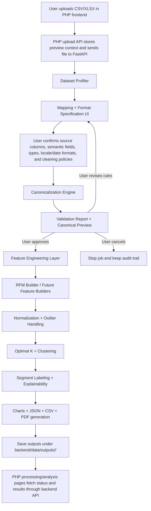
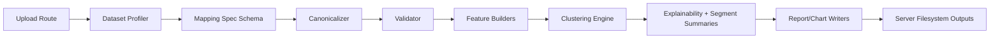

# Customer360 Pipeline Redesign Prompt

## Purpose
Use this prompt as the implementation blueprint for a more intelligent, modular, and user-guided customer-data pipeline.

The current pipeline is useful, but it assumes a mostly standard transaction dataset and relies too much on automatic parsing. The new design should keep the successful RFM + clustering + reporting workflow, but add a strong **schema mapping + data type/format normalization + validation** layer before analysis starts.

## Core Product Goal
When a user uploads a dataset, the system should not jump directly into analysis using guessed assumptions. Instead, the product should:

1. Profile the uploaded file.
2. Show a rich column-mapping and format-mapping UI.
3. Let the user explicitly tell the system which columns mean what and how they are formatted.
4. Convert the raw file into a canonical internal schema.
5. Validate that conversion and show a preview/report.
6. Run customer segmentation on the canonical dataset.
7. Save all outputs on the server under `backend/data/outputs/<job_id>/`.

---

# Prompt To Build The Better Pipeline

You are improving the Customer360 analytics backend and frontend upload flow.

Build a production-quality, modular customer-data pipeline that supports diverse business datasets from different users, regions, and formatting conventions. The pipeline must preserve the current customer segmentation outcome, but make the ingestion and preprocessing stage much more explicit, resilient, auditable, and user-controlled.

## What Must Change

### 1. Introduce a formal dataset profiling stage
After upload, inspect the file and return a structured profile for each column:
- column name
- detected data type candidates
- sample values
- null rate
- uniqueness ratio
- likely business semantic candidates such as `customer_id`, `transaction_date`, `transaction_id`, `amount`, `product`, `category`, `quantity`
- confidence score for each semantic guess
- likely date format candidates if the column looks like a date
- likely numeric locale candidates if the column looks like money or quantity

Do not assume one locale. A monetary value like `1.234,54` and `1,234.54` must be distinguishable.

### 2. Replace “simple column mapping” with “schema + format mapping”
The frontend mapping screen should ask not only “which column is amount?” but also “how should that amount be parsed?”

For each mapped field, the user should be able to define:
- source column
- target semantic field
- data type
- date format if date-like
- decimal separator and thousands separator if numeric-like
- currency symbol or ISO currency code if monetary
- negative-value policy for amounts
- missing-value policy
- duplicate handling policy where relevant

Also support **derived fields** when the dataset does not contain the exact final metric directly.
Example: if the file has `Quantity` and `UnitPrice` but not a line-total sales column, the user should be able to define:

`amount = Quantity * UnitPrice`

This matters for classic retail invoice data where each row is a line item, not a full invoice total.

### 3. Build a canonicalization layer
Create a dedicated backend transform layer that converts raw columns into one internal canonical schema before RFM or clustering runs.

Example target schema:
- `customer_id` as string
- `invoice_id` as string
- `invoice_date` as timezone-normalized timestamp/date
- `amount` as decimal/float in a consistent numeric format
- `quantity` as numeric if present
- `product` as string if present
- `category` as string if present
- `currency` as normalized code if known

This conversion must be driven by the user mapping spec and backed by clear conversion functions, not only generic `pd.to_datetime()` and `pd.to_numeric()`.

### 4. Add a validation report before clustering
After canonicalization, produce a validation payload that the UI can show before launching clustering:
- rows parsed successfully
- rows rejected and why
- parse success rate by field
- date range
- total revenue sanity check
- customer count
- duplicate transaction count
- suspicious negative/zero amount patterns
- warnings for synthetic fields
- a preview of canonicalized rows
- whether Monetary is coming from a direct amount column or a derived formula such as `quantity * unit_price`
- how many rows were dropped because they have no customer identifier
- how many rows were blank/empty and removed before enforcing row limits

The user should be able to continue, go back and adjust mapping rules, or cancel the job.

### 5. Make feature engineering modular
The first segmentation mode can stay RFM-based, but do not hardwire preprocessing so tightly to one transaction schema that future models become hard.

Create a modular feature layer such as:
- `TransactionRFMFeatureBuilder`
- `CustomerProfileFeatureBuilder`
- `HybridBehaviorFeatureBuilder`

For now, implement the RFM builder first, but design the interfaces so additional feature builders can be plugged in later.

### 6. Keep clustering and explanation stages, but consume canonical customer features
Once canonicalization and validation pass:
- aggregate transaction-level data into customer-level features
- normalize/transform those features
- run optimal-K selection and clustering
- assign segment labels
- compute explainability
- generate charts
- save JSON, CSV, and PDF outputs

### 7. Store uploads and outputs on the server filesystem, not Supabase
Uploaded source files should be written to:
`backend/data/uploads/<job_id>/<filename>`

Analysis outputs should be written to:
`backend/data/outputs/<job_id>/`

Return file paths/job metadata through the API, and keep the frontend talking to the Python backend through the PHP proxy.

---

# Proposed End-To-End Flow



## Backend Module Flow



---

# Suggested Backend Architecture

## 1. New/Refactored Modules

| Module | Responsibility | Notes |
|---|---|---|
| `analytics/profiling.py` | Infer column types, sample values, semantic candidates, date/numeric format candidates | This powers the mapping UI and reduces blind guessing |
| `analytics/mapping_spec.py` | Define the user-selected mapping contract | Use a Pydantic model so the API contract is explicit |
| `analytics/canonicalization.py` | Convert raw values into canonical internal fields using mapping + format rules | This is where locale-aware currency/date conversion should live |
| `analytics/validation.py` | Generate parse-quality and data-quality reports | Should return machine-readable warnings/errors and preview rows |
| `analytics/features/rfm.py` | Build customer-level RFM features from canonical transactions | Keep this separate from raw parsing |
| `analytics/clustering.py` | Cluster normalized feature matrices | Keep but consume canonical feature output |
| `analytics/segments.py` | Segment labeling and segment summaries | Keep business interpretation separate from model fitting |
| `analytics/reporting.py` | Serialize JSON, customer CSV, charts, PDF | Keep output writing consistent and testable |

## 2. Strong Internal Data Contract

Use a canonical transaction table like this before any RFM logic runs:

| Canonical Field | Type | Required? | Meaning |
|---|---|---|---|
| `customer_id` | string | Yes, or synthetic with warning | Customer identity key used for grouping |
| `invoice_id` | string | Optional | Transaction/order identifier |
| `invoice_date` | datetime/date | Yes, or synthetic with warning | Transaction timestamp/date for recency |
| `amount` | float/decimal | Yes | Monetary value in normalized numeric representation |
| `quantity` | float/int | Optional | Number of units |
| `product` | string | Optional | Product identifier/name |
| `category` | string | Optional | Product/service category |
| `currency` | string | Optional | Currency code or inferred display currency |

---

# Proposed Mapping UI Behavior

## Column Mapping + Format Rules Table

| Target Field | Source Column Select | Data Type Select | Format Controls | Policy Controls |
|---|---|---|---|---|
| Customer ID | dropdown from file columns | string/id | trim, uppercase/lowercase normalization | duplicate handling, null handling |
| Invoice Date | dropdown from file columns | date/datetime | date format select, timezone select, day-first toggle | invalid date policy |
| Invoice ID | dropdown from file columns | string/id | trim, preserve leading zeros toggle | duplicate invoice policy |
| Amount | dropdown from file columns **or formula builder** | money/number | decimal separator, thousands separator, currency symbol/code | negative value policy, zero amount policy |
| Quantity | dropdown from file columns | integer/number | decimal separator if fractional quantity is possible | zero/negative quantity policy |
| Unit Price | dropdown from file columns | money/number | decimal separator, thousands separator, currency symbol/code | zero/negative value policy |
| Product | dropdown from file columns | string/category | text cleaning mode | missing value policy |
| Category | dropdown from file columns | string/category | text normalization mode | missing value policy |

## Example UI State For One Field

| Setting | Example |
|---|---|
| Target field | `amount` |
| Source column | `OrderValue` |
| Data type | `money` |
| Decimal separator | `,` |
| Thousands separator | `.` |
| Currency symbol | `€` |
| Negative policy | `Treat negative as refund` |
| Missing policy | `Reject row if amount is blank` |
| Preview conversion | raw `1.234,54 €` → canonical `1234.54` |

## Example UI State For A Derived Monetary Field

| Setting | Example |
|---|---|
| Target field | `amount` |
| Source mode | `Derived formula` |
| Formula | `Quantity * UnitPrice` |
| Quantity source column | `Quantity` |
| Unit price source column | `UnitPrice` |
| Unit price format | decimal=`.` thousands=`,` currency=`GHS` |
| Negative quantity policy | `Treat negative quantity as refund/return` |
| Preview conversion | raw `Quantity=6`, `UnitPrice=2.55` → canonical `amount=15.30` |

## Validation Report UI Table

| Check | Status | Example Output |
|---|---|---|
| Rows parsed | success/warning/error | `29,840 / 30,000 rows parsed successfully` |
| Date parse quality | success/warning/error | `99.2% parsed using DD/MM/YYYY` |
| Amount parse quality | success/warning/error | `98.7% parsed using decimal=',' thousands='.'` |
| Customer coverage | success/warning/error | `9,420 unique customers detected` |
| Duplicate invoices | info/warning/error | `180 duplicate invoice IDs found` |
| Negative amounts | info/warning/error | `242 negatives treated as refunds` |
| Rejected rows | warning/error | `160 rows rejected, downloadable review CSV available` |
| Missing customer IDs | warning/error | `14,954 rows excluded because no CustomerID was present` |
| Derived amount check | success/warning/error | `Monetary computed as Quantity × UnitPrice` |
| Blank rows removed | info/warning | `500,521 empty rows removed before row-limit validation` |

---

# User Guidance / Mini Tutorial Text The UI Should Show

The product should actively explain RFM requirements in plain language so a business owner knows what to provide before upload.

## Suggested “What We Need From Your Data” Panel

| RFM Requirement | What The User Should Provide | Why It Matters |
|---|---|---|
| Customer identifier | `CustomerID`, `ClientID`, `Phone`, `Email`, or another stable person/account key | RFM groups transactions by customer, so without a stable customer key we cannot compute true customer-level Frequency and Monetary |
| Transaction date | `InvoiceDate`, `OrderDate`, `PurchaseDate` | Recency is calculated from the customer’s latest purchase date |
| Transaction/order identifier | `InvoiceNo`, `OrderID`, `ReceiptID` | Frequency is usually counted by unique invoices/orders, not raw line rows |
| Monetary value | either a direct total amount column, or `Quantity + UnitPrice` so we can derive amount | Monetary should reflect actual spend, not just unit price |
| Optional product/category fields | `Description`, `StockCode`, `Category`, `Country`, `Channel` | These can enrich segment summaries and explain what each customer group tends to buy |

## Suggested Inline Notices

Show these as friendly but explicit notices during upload/mapping:

- **Customer ID notice:** “For customer-level RFM, each row must belong to a customer. If some rows have no customer ID, those rows will be excluded unless you choose a fallback identity rule.”
- **Amount notice:** “If your file has `Quantity` and `UnitPrice` instead of a total sales amount, choose the formula option so we compute `Amount = Quantity × UnitPrice`.”
- **Date notice:** “Tell us the exact date format if your dates are ambiguous. For example, `12/10/2023` could mean 12 October or 10 December depending on your region.”
- **Blank rows notice:** “Files exported from spreadsheets sometimes contain thousands of trailing empty rows. We remove fully empty rows first before enforcing dataset size limits.”
- **Refunds notice:** “Negative amounts or negative quantities may represent returns/refunds. Choose how you want those rows handled before segmentation.”
- **Invoice frequency notice:** “If one invoice appears on many product rows, Frequency should usually count unique invoice IDs, not line-item rows.”

## Suggested Pre-Upload Checklist

| Check | User-facing Question |
|---|---|
| Stable customer key | “Can we identify the same customer across multiple purchases?” |
| Date field | “Which column tells us when the purchase happened, and what format is it in?” |
| Monetary field | “Does your file already contain total spend per line/order, or should we calculate it from quantity and unit price?” |
| Invoice key | “Which column identifies a transaction/order so we don’t overcount frequency?” |
| Refund/return logic | “Do negative values represent refunds, cancelled sales, or data errors?” |
| Multi-currency | “Is this dataset in one currency, or do we need a currency column?” |

---

# RFM Edge-Case Policy Table

Use this table to define exactly how the product should behave when a dataset is incomplete, ambiguous, or messy.

| Edge Case | Why It Matters For RFM | Default System Behavior | User Option / UI Message |
|---|---|---|---|
| No `customer_id`, but another identity field exists such as `email`, `phone`, `loyalty_id` | RFM needs repeat purchases grouped by the same customer | Suggest those columns as customer identity candidates and let the user map one | “Choose the column that consistently identifies the same customer across purchases.” |
| No `customer_id` and no alternative stable identity field | True customer-level RFM cannot be computed | Block standard customer-RFM and do not silently treat invoice rows as customers | “This file does not contain a stable customer identifier. Customer-level RFM is not valid unless you add one. You may choose invoice-level segmentation as a separate fallback, but this will not represent customer loyalty.” |
| Missing `invoice_id` but `customer_id`, `invoice_date`, and `amount` exist | Frequency can still be approximated, but unique-order counting is impossible | Allow RFM, but compute Frequency by row count or distinct purchase dates and show a warning | “No invoice/order ID was mapped. Frequency will be based on row count or purchase-date count, which may overcount line-item files.” |
| Same invoice appears on many product rows | Counting raw rows inflates Frequency | If `invoice_id` exists, compute Frequency by unique invoice count; if not, warn strongly | “Multiple rows can belong to one order. Map Invoice ID so Frequency reflects purchases, not line items.” |
| `amount` missing but `quantity` and `unit_price` exist | Monetary can be derived safely if both fields parse correctly | Offer derived amount formula `quantity * unit_price` | “No total amount column found. We can compute Amount from Quantity × Unit Price.” |
| `amount` present but looks like a unit price, not total spend | Monetary would be understated for multi-quantity rows | Flag this when `quantity` exists and amount distribution looks too close to unit price values | “This amount column may represent unit price, not line total. If so, use the formula builder.” |
| Mixed currency symbols/codes in one file | Monetary totals become inconsistent if currencies are summed without normalization | Require one canonical currency or a conversion policy before clustering | “Your file appears to contain multiple currencies. Choose one reporting currency and provide conversion rules, or segment by one currency subset only.” |
| European number format like `1.234,54` | Generic numeric parsing can corrupt values | Require decimal/thousands separator confirmation for money fields if ambiguity is detected | “Confirm the numeric format for this amount column before continuing.” |
| Ambiguous date format like `12/10/2023` | Recency changes depending on day-first vs month-first interpretation | Ask user to select exact date format or day-first policy | “This date format is ambiguous. Is this 12 October or 10 December?” |
| Timezone-aware timestamps mixed with local dates | Recency and date ordering may shift unexpectedly | Normalize to a user-selected timezone before aggregation | “Choose the business timezone used for transaction dates.” |
| Refunds/returns encoded as negative amount or negative quantity | Monetary and Frequency can be distorted if returns are treated as purchases | Default to “treat negative line totals as refunds and subtract from Monetary”; optionally exclude cancelled invoices from Frequency | “Negative values were detected. Should these be treated as refunds, cancelled transactions, or invalid rows?” |
| Zero amount rows | Free samples, failed orders, or dirty data can distort Monetary | Warn and let user choose keep/exclude | “Rows with zero amount were found. Keep them only if free transactions are meaningful to your analysis.” |
| Missing `CustomerID` on some rows but not all rows | Anonymous/guest transactions cannot be assigned to a customer | Exclude those rows from customer-level RFM and report exact exclusion count | “Some rows have no customer ID and will be excluded from customer segmentation.” |
| Duplicate rows caused by export issues | Double-counted Monetary and Frequency | Detect exact duplicates and let user choose deduplication | “Duplicate rows were detected. Review whether these are real repeated transactions or export duplicates.” |
| Same customer represented by multiple IDs | One customer’s behavior is split across many pseudo-customers | Provide optional identity reconciliation rules only when trustworthy matching columns exist | “Multiple customer IDs may refer to the same person. If you have email/phone/name fields, you can apply a merge rule.” |
| Very large file with many empty trailing rows | Row-limit checks may reject a valid export unfairly | Drop fully empty rows first, then enforce row limits on usable rows | “We removed blank rows before validating the dataset size.” |
| Sparse date history with only one purchase date for most customers | Recency still works, but segment separation may rely heavily on Monetary and Frequency | Run clustering but warn that low temporal diversity weakens Recency signal | “Most customers have a single purchase date, so Recency may carry less segmentation power.” |
| Extremely skewed spend where one customer dominates revenue | Clustering can become unstable and overfit whales | Use outlier capping/log transforms and report concentration warnings | “A small number of customers dominate revenue. We applied robust scaling and will flag this in validation.” |
| Too few customers after cleaning | Clustering metrics and segment interpretation become unreliable | Block clustering if customer count falls below a minimum threshold, or reduce max K | “After cleaning, there are too few customers for reliable segmentation.” |
| Too many unique customers with one transaction each | Frequency collapses to mostly 1, reducing RFM signal | Warn and rely more on Recency/Monetary, or recommend collecting longer history | “Most customers appear only once. Frequency may not distinguish segments strongly.” |
| Invoice dates in the future | Recency can become negative or misleading | Flag and let user choose reject or cap to analysis date | “Future-dated transactions were found. Please confirm whether these are valid scheduled orders.” |
| Customer IDs stored as floats like `17850.0` | ID formatting can become ugly and inconsistent | Normalize to clean string IDs, preserving true integer identity where possible | “Customer IDs will be standardized to text labels before grouping.” |
| Excel-export artifacts like unnamed index columns | Non-business columns can pollute auto-mapping suggestions | Detect and deprioritize obvious index columns such as `index`, `Unnamed: 0` | “We detected spreadsheet index columns and excluded them from semantic suggestions.” |

## Recommended Minimum Valid Schemas For RFM

| RFM Mode | Required Fields | Optional But Recommended | Notes |
|---|---|---|---|
| Standard customer RFM | `customer_id`, `invoice_date`, `amount` or `quantity + unit_price` | `invoice_id`, `product`, `category`, `country/channel` | Best default mode for repeat-purchase businesses |
| Order-frequency-safe RFM | `customer_id`, `invoice_date`, `invoice_id`, `amount` or `quantity + unit_price` | `product`, `category` | Preferred for line-item invoice files so Frequency counts unique orders |
| Partial RFM with weak frequency | `customer_id`, `invoice_date`, `amount` | `product`, `category` | Allowed, but warn that Frequency may use row count or date count if no invoice ID exists |
| Invoice-level fallback segmentation | `invoice_id`, `invoice_date`, `amount` or `quantity + unit_price` | `product`, `category` | Not true customer segmentation. Use only if no customer identity exists and label it clearly as order-level analysis |

---

# Conversion Rules That Must Be Supported

## Money/Number Parsing Examples

| Raw Value | User-Declared Format | Canonical Output |
|---|---|---|
| `1,234.56` | decimal=`.` thousands=`,` | `1234.56` |
| `1.234,56` | decimal=`,` thousands=`.` | `1234.56` |
| `GHS 2,450.00` | currency=`GHS`, decimal=`.`, thousands=`,` | `2450.00` and currency=`GHS` |
| `€ 2.450,00` | currency=`€`, decimal=`,`, thousands=`.` | `2450.00` and currency=`EUR` if mapped |
| `(120.50)` | parentheses mean negative | `-120.50` |
| `Quantity=8`, `UnitPrice=3.50` | derived amount formula `Quantity * UnitPrice` | `28.00` |

## Date Parsing Examples

| Raw Value | User-Declared Format | Canonical Output |
|---|---|---|
| `12/10/2023` | `%d/%m/%Y` | `2023-10-12` |
| `10/12/2023` | `%m/%d/%Y` | `2023-10-12` |
| `2023-10-12 14:30:00` | `%Y-%m-%d %H:%M:%S` | `2023-10-12T14:30:00` |
| `12 Oct 2023` | `%d %b %Y` | `2023-10-12` |

---

# What Is Currently Correct vs What Should Change

| Area | Current Code Behavior | Keep? | Better Target Behavior |
|---|---|---|---|
| Upload to backend | PHP forwards file and JWT to FastAPI | Yes | Keep this proxy architecture |
| Column mapping | User maps a few fixed fields | Partially | Expand mapping to include type/format/policy metadata |
| Auto suggestions | Heuristic column-name matching | Yes, but improve | Add confidence scores and value-based profiling |
| Amount parsing | Generic `pd.to_numeric(..., errors='coerce')` | No | Locale-aware parser driven by user format spec |
| Amount semantics | Assumes a single mapped `amount` column | No | Support either direct amount or derived amount from `quantity * unit_price` |
| Date parsing | Auto parse first, then try known formats | Partially | Let user override exact date format and timezone |
| Missing customer/date | Synthetic fallback | Partially | Keep only with explicit user consent and strong warning |
| Blank rows and row limits | Row-count validation happens before empty-row cleanup | No | Drop fully empty rows first, then enforce size limits on usable rows |
| Missing customer IDs | Rows may be silently dropped during cleaning | Partially | Show exact exclusion counts and warn that true customer RFM needs a stable customer key |
| RFM computation | Customer-level grouping from canonical transaction fields | Yes | Keep but move after explicit canonicalization |
| Output location | `backend/data/outputs/<job_id>/` | Yes | Keep and standardize artifact naming |
| Supabase upload mirror | Optional mirror of source file | No | Remove if server-local filesystem is the production storage decision |

---

# Recommended API Design

## Endpoint Sequence

| Step | Endpoint | Purpose |
|---|---|---|
| 1 | `POST /api/jobs/upload/preview` | Upload temporary file and return profile + suggested mapping + sample rows |
| 2 | `POST /api/jobs/validate-mapping` | Submit mapping + format spec and receive canonical preview + validation report |
| 3 | `POST /api/jobs/start` | Start analysis using the accepted mapping spec and local uploaded file |
| 4 | `GET /api/jobs/status/{job_id}` | Poll progress/status |
| 5 | `GET /api/jobs/results/{job_id}` | Fetch completed results |
| 6 | `GET /api/jobs/report/{job_id}` | Download PDF report |

## Mapping Spec JSON Example

```json
{
  "fields": {
    "customer_id": {
      "source_column": "CustomerCode",
      "data_type": "string",
      "trim_whitespace": true,
      "missing_policy": "reject_row"
    },
    "invoice_date": {
      "source_column": "OrderDate",
      "data_type": "date",
      "date_format": "%d/%m/%Y",
      "timezone": "Africa/Accra",
      "missing_policy": "reject_row"
    },
    "invoice_id": {
      "source_column": "InvoiceNo",
      "data_type": "string",
      "preserve_leading_zeros": true,
      "missing_policy": "allow_null"
    },
    "amount": {
      "source_column": "OrderAmount",
      "data_type": "money",
      "decimal_separator": ",",
      "thousands_separator": ".",
      "currency_symbol": "€",
      "negative_policy": "refund",
      "missing_policy": "reject_row"
    },
    "quantity": {
      "source_column": "Quantity",
      "data_type": "number",
      "missing_policy": "allow_null"
    },
    "unit_price": {
      "source_column": "UnitPrice",
      "data_type": "money",
      "decimal_separator": ".",
      "thousands_separator": ",",
      "currency_symbol": "GHS",
      "missing_policy": "allow_null"
    },
    "product": {
      "source_column": "ItemName",
      "data_type": "string",
      "missing_policy": "allow_null"
    },
    "category": {
      "source_column": "Category",
      "data_type": "string",
      "missing_policy": "allow_null"
    }
  }
}
```

## Derived Field Rule Example

```json
{
  "derived_fields": {
    "amount": {
      "formula": "quantity * unit_price",
      "required_inputs": ["quantity", "unit_price"],
      "negative_policy": "refund"
    }
  }
}
```

---

# Implementation Principles

1. Do not bury business assumptions inside one large preprocessing function.
2. Separate **schema detection**, **user mapping**, **type conversion**, **validation**, **feature engineering**, **clustering**, and **reporting**.
3. Keep each stage testable with clear input/output contracts.
4. Never silently coerce large amounts of bad data without telling the user.
5. If synthetic values are generated, make that explicit in both API response and UI.
6. Prefer deterministic user-declared formats over broad auto-parsing when the dataset is ambiguous.
7. Save all source and output artifacts to server-local job folders.

---

# Acceptance Criteria

The redesign is successful when:
- a user can upload a non-standard CSV with regional amount/date formats and still map it correctly
- a user can upload line-item invoice data with `Quantity` and `UnitPrice` and the system can compute Monetary correctly
- a user receives clear warnings when many rows have missing customer IDs and understands that those rows cannot contribute to true customer-level RFM
- exported spreadsheets with many empty trailing rows are cleaned before row-limit validation
- the UI shows both semantic column mapping and parse-format settings
- the backend converts raw rows into a canonical schema deterministically
- validation warnings are shown before clustering begins
- RFM segmentation still runs and writes outputs to `backend/data/outputs/<job_id>/`
- the user can trace what transformations happened and why rows were accepted/rejected
- the system remains modular enough to add future feature builders beyond RFM
